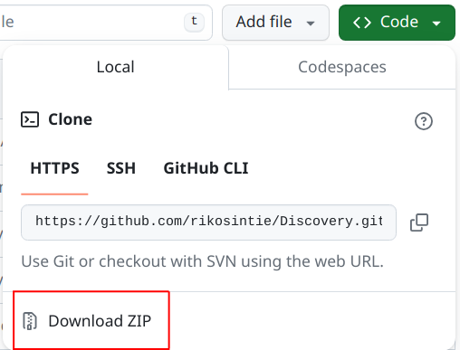

# Getting Started

----------------------------------------------------------------


----------------------------------------------------------------

The scripts run on Mac/Linux/Windows! It took some effort to get all the paths and other details working across all three platforms but it was worth the effort in the end!

You do not need any prior python programming experience to use them. The instructions below will walk you through step by step how to install the Python Virtual Environment, the required libraries and activating the python virtual environment. If you have never used Python on your machine there are some additional steps required to use the scripts. They are describe below.

- Clone the repository from GitHub
- Create a Python Virtual Environment
- Activate the Python Virtual Environment
- Install dependencies
- Deactivate the Python Virtual Environment

Let's get started!

----------------------------------------------------------------

## 1. Clone the Repository

All of the installation steps are done in the Mac/Linux terminal or cmd.exe/PowerShell on Windows. In my recent testing on Windows 11 24H2, I learned a lot about PowerShell on Windows 11. I created a page on what my setup looks like. I highly recommend installing the Windows Terminal and setting up PowerShell if you are a Windows user. Here is a link to the page - [Using PowerShell with the Network Discovery scripts](Using_PowerShell.md)

Open the terminal or PowerShell

```bash
git clone https://github.com/rikosintie/Discovery.git
cd Discovery
```

If you are on Windows and don't have git installed, use `winget install --id Git.Git -e --source winget` to install Git or install the `git` package from [The Official Git Page](https://git-scm.com/downloads/win).

If you are on macOS and don't have git installed, you can install the xcode command line tools. Instructions are located [below](Getting_Started.md/#macos)

If you don't want to install git, you can download a zip file from the [Network Discovery repository](https://github.com/rikosintie/Discovery). Click on the green "Code" button and select "Download ZIP". Then unzip the file and cd into the `Discovery` directory.

----------------------------------------------------------------



----------------------------------------------------------------

I recommend installing Git. I make updates to the project and if you have git installed you can simply run `git pull` to pull down the latest version. Also, there are thousands of projects on GitHub.com and GitLab.com. Once you get comfortable with `git` you will have access to a lot of tools! You can install git from [The official Git page](https://git-scm.com/downloads).

If you plan to modify the python scripts then this won't work because your versions will be different than the repo and git will not allow you to overwrite. In that case, open a Pull Request on the repo and I'll see if I can accept your changes!

!!! Info
    Once you have the repository cloned it is linked to the repository on github.com. You should issue a `git pull` from the terminal once in a while to pull down any changes that have been made to the repository.

## 2. Using a Python Virtual Environment

I recommend running the scripts in a Python Virtual environment, especially if you on Mac/Linux.

### On Ubuntu

If you are on a brand new install of Ubuntu and haven't done any python coding you will need to setup your environment before creating the virtual environment. We need to know what version of python you have installed. From a terminal, run the following:

```bash
which python3
/usr/bin/python3
ls -l /usr/bin/python3
lrwxrwxrwx - root  7 Aug  2024  /usr/bin/python3 -> python3.12
```

So, Python 3.12 is what my new Ubuntu 24.04 VM has installed. Run the following, replace 3.12 with your Python version.

```bash
sudo apt install python3.12-venv
sudo apt install pip
```

This will install the Python virtual environment library and pip, the  official package installer for Python.

### macOS

I installed the `xcode command line tools`, because it includes Python, a `c` compiler and many other tools. Open a terminal and run `xcode-select --install`. You can list the tools using `ls /Library/Developer/CommandLineTools/usr/bin/`

### On Windows

I think Windows installs both of those packages when you install Python from the Microsoft store because I didn't have to install them on Windows. You can use `where python` to see what version of python is install on Windows.

----------------------------------------------------------------

### Create the Python Virtual Environment

`python -m venv venv --upgrade-deps --prompt="Discovery"`

This will create the standard "venv" directory but when activated will display "Discovery". I prefer this over using `python -m venv Discovery` because it's the standard way to create the virtual environment. But I like seeing Discovery instead of venv when I activate the environment.

The `--upgrade-deps` argument tells python to upgrade pip to the latest version when creating the virtual environment. You need internet access for pip to be upgraded. If you don't have internet access, remove the `--upgrade-deps` argument.

----------------------------------------------------------------

!!! Note "Windows 11 24h2 issues"
    I developed the script on a Windows 11 22h1 laptop. On June 29, 2025 I cloned the repo to a Windows 11 24h2 laptop to demo for a friend and nothing worked! For some reason, Windows 11 24h2 installs Python 13.1 which is bleeding edge and several of the libraries I use haven't been updated to work with 13.1.

----------------------------------------------------------------

To resolve the issue, I installed Python 3.10 from the Windows store using:

```text
start menu, microsoft store, python 3.10
Get
```

Then I used `python3.10 -m venv venv --upgrade-deps --prompt="Discovery"` to successfully install the script with Python 3.10.

----------------------------------------------------------------

## 3. Activate the Virtual Environment

### On Windows 11

`.\venv\Scripts\activate`

Verify that python is in the venv:

```text
where python
C:\Users\mhubbard.PU\Documents\04_tools\Discovery\venv\Scripts\python.exe
```

### On WSL

When the Windows install initially failed, I asked ChatGPT what to do and it recommended installing WSL2, Ubuntu 24.04 and running the script in Linux. I did that and everything worked correctly by following the `Linux` steps below. The WSL terminal NATs to your laptop so you will be using a 172.16.122.x address but everything worked. For NetDevOps, Linux is more popular than Windows, I would go the WLS route.

#### Navigating in WSL

If you haven't used Linux before, navigating the WSL terminal paths will be a learning experience. ChatGPT wrote this function that makes it easier to navigate:

From the WSL Ubuntu terminal, open the BASH configuration file using - `nano ~/bashrc`, go to the bottom of the file and paste in the two lines below.

```bash
# Function to convert windows paths to Linux format
 wincd () { cd $(wslpath $1); }
```

Type `ctrl+x` to exit nano, select y to `Save modified buffer?`

Type `exec bash` to reload the shell.

Then use it like:

`wincd 'c:\Users\mhubbard\Documents\Discovery'

The command will take you to the WSL `/mnt/c/Users/mhubbard/Documents/Discovery` directory.

I prefer to zsh as my shell with Oh My Zsh. If you continue to use WSL I recommend that you look at my guide to setting up the [Ubuntu terminal](https://rikosintie.github.io/Ubuntu4NetworkEngineers/terminal/). The guide is chalked full of Ubuntu goodness.

### On macOS/Linux

`source venv/bin/activate`

#### Verify that Python is installed in the venv

```bash
~/04_tools/Discovery
which python3
/home/mhubbard/04_tools/Discovery/venv/bin/python3
```

You should see a path pointing to the Discovery folder, then venv/bin/python3.

## 4. Install Dependencies

You can use `pip list` to list the packages currently installed. If you run it now you will see:

```bash
$ pip list
Package    Version
---------- -------
pip        23.3.2
setuptools 69.0.3
```

Now run the following:

`pip install -r requirements.txt`

You will see all the dependencies being downloaded and installed. Here is a snippet of the dependencies.

```bash
$ pip install -r requirements.txt
Collecting asttokens~=2.4.1 (from -r requirements.txt (line 1))
  Downloading asttokens-2.4.1-py2.py3-none-any.whl.metadata (5.2 kB)
Collecting bcrypt~=4.1.2 (from -r requirements.txt (line 2))
  Downloading bcrypt-4.1.2-cp39-abi3-manylinux_2_28_x86_64.whl.metadata (9.5 kB)
```

Now if we run `pip list` we will see that the dependencies have been installed:

```bash
$ pip list
Package       Version
------------- -------
asttokens     2.4.1
bcrypt        4.1.2
cffi          1.16.0
colorama      0.4.6
cryptography  41.0.7
executing     2.0.1
future        0.18.3
icecream      2.1.3
netmiko       4.3.0
ntc_templates 4.1.0
paramiko      3.4.0
pip           23.3.2
prettytable   3.9.0
pycparser     2.21
Pygments      2.17.2
PyNaCl        1.5.0
pyserial      3.5
PyYAML        6.0.1
scp           0.14.5
setuptools    69.0.3
six           1.16.0
textfsm       1.1.3
wcwidth       0.2.12

```

## 5. Deactivate the Virtual Environment

When you are finished, deactivate the environment

`deactivate`

You will need to activate the virtual environment each time you want to run the scripts.

----------------------------------------------------------------
