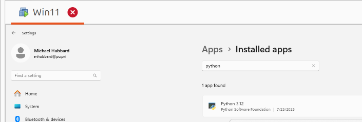
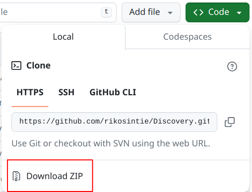

# Getting Started

----------------------------------------------------------------


----------------------------------------------------------------

The scripts run on Mac/Linux/Windows! It took some effort to get all the paths and other details working across all three platforms but it was worth the effort in the end! You do not need any prior python programming experience to use them. The instructions below will walk you through step by step how to install Python, the Python Virtual Environment, the required libraries and activating the python virtual environment.

- Clone the repository from GitHub
- Create a Python Virtual Environment
- Activate the Python Virtual Environment
- Install dependencies
- Deactivate the Python Virtual Environment

Let's get started!

----------------------------------------------------------------

## 0. Install Python if you need it

Python is a popular programming language for Network Development Operations (NetDevOps). It's well worth the time to install Python and learn the basics of running Python scripts.

### Windows 10 and Windows 11

If you haven't done any  Python development on your Windows machine it doesn't have Python or Git installed. Python is the language the scripts are written in and Git is the industry standard version control system for NetDevOps. Follow the instructions below to install both packages.

!!! note
    From [docs.python.org](https://docs.python.org/3.11/using/windows.html)
    Unlike most Unix systems and services, Windows does not include a system supported installation of Python. To make Python available, the CPython team has compiled Windows installers with every release for many years. These installers are primarily intended to add a per-user installation of Python, with the core interpreter and library being used by a single user.

Installing Python on Windows is simple.

- click the start menu
- Type `microsoft store` and press `enter`
- search for `python 3.12`
- Click on the `Free` button
- click on `Get`

----------------------------------------------------------------


----------------------------------------------------------------

One advantage of installing Python on Windows is the installer installs Python, pip and the Python Virtual environment `venv`. You can use `where python` from cmd.exe to verify that Python is installed.

```text
where python
C:\Users\mhubbard\AppData\Local\Microsoft\WindowsApps\python.exe
```

You can also use the GUI tool `Add or Remove Programs` to verify Python is installed:

----------------------------------------------------------------



----------------------------------------------------------------

#### Test the installation on Windows

```text
python
```

You should see something like this:

```bash
Python 3.12.10 (tags/v3.12.10:0cc8128, Apr  8 2025, 12:21:36) [MSC v.1943 64 bit (AMD64)] on win32
Type "help", "copyright", "credits" or "license" for more information.
```

To quit Python, type:

```bash
quit()
```

#### Install Git

If you are on Windows and don't have git installed, use

```text
winget install --id Git.Git -e --source winget
```

from cmd or PowerShell to install Git.

WinGet, also known as the Windows Package Manager, is pre-installed on Windows 11 versions 21H2 and later. If you don't have `winget` installed, you can install it using these steps:

- Type `microsoft store` in the Windows search bar, press `enter`
- Search for `App Installer`
- Click on `Get`

Or you can install the `git` package from [The Official Git Page](https://git-scm.com/downloads/win). It seems better to use the Microsoft Store but I'm not a Windows expert.

#### Install Coreutils for Windows

Every `grep`/`sort`/`uniq`/`cut`/`find`/`wc`/`head`/`tail` example throughout
these docs was written for Mac/Linux, since Windows never shipped these
tools natively — until now. Microsoft publishes a native Windows build of
the [uutils/coreutils](https://uutils.org/coreutils/docs/) project (a Rust
reimplementation of the classic GNU tools) that includes a compatible
`grep` and `find` too:

```text
winget install Microsoft.Coreutils
```

from cmd or PowerShell. This is the package to ask for —
`winget install uutils.coreutils` (no `Microsoft.` prefix) installs a
narrower package that's missing `grep` entirely, since `grep` and `find`
are separate projects bundled in on top. See the full list of what's
included on [Microsoft Learn](https://learn.microsoft.com/en-us/windows/core-utils/commands).

**`sed` and `awk` are not part of this package** — they're their own
separate GNU projects, not "core" utilities, and Microsoft hasn't shipped
native ports of either. Where a command in these docs pipes through `awk`,
run it from WSL or Git Bash instead, or replace it with PowerShell's own
text handling (`-split`, `ForEach-Object`) — see the [connected-ports
example](usage.md#find-connected-ports) for a worked substitute.

**Name collisions.** A handful of the installed commands share a name with
something PowerShell already has built in — `cat`, `cp`, `ls`, `mv`, `rm`,
`sort`, and a few others are also PowerShell aliases (for `Get-Content`,
`Copy-Item`, `Get-ChildItem`, etc.), and PowerShell checks its own aliases
*before* it looks at `$env:PATH`, so typing the bare name runs the
PowerShell one, not the coreutils one. The one that actually shows up in
these docs is `sort`: PowerShell's `sort` is `Sort-Object`, which doesn't
understand GNU sort's `-t`/`-k` flags at all. The fix is always the same —
type the `.exe` suffix to skip the alias and go straight to the real
binary:

```text
sort.exe -t '/' -k1,1 -k2,2n -k3,3n
```

`grep`, `find`, `cut`, `uniq`, `wc`, `head`, and `tail` have no such
collision in PowerShell — they run as typed, no `.exe` needed. (cmd.exe has
no alias layer at all, but Windows' own decades-old `sort.exe`/`find.exe`
in `System32` can still shadow the coreutils version there depending on
`PATH` order — the same `.exe`-suffix trick doesn't help in that shell,
since cmd already resolves bare names straight to an `.exe`; if `sort`/`find`
misbehave in cmd, check `where sort` and put the coreutils install
directory earlier in `PATH`.)

----------------------------------------------------------------

### macOS

Apple provides a package called `xcode-select` full of developer tools like `Python`, `git`, and `gcc` (Gnu C Compiler), etc. To install `xcode-select`

- Open a terminal
- Type `xcode-select --install`, press `enter`

You can list the tools using

```bash
ls /Library/Developer/CommandLineTools/usr/bin/`
```

You now have `Python`, `git`, `venv` and many other dev tools.

### Ubuntu 24.04 or higher

If you are on a brand new install of Ubuntu and haven't done any python coding you will need to install the Python `venv` and `pip` libraries before creating the virtual environment. We need to know what version of python you have installed. From a terminal, run the following:

```bash hl_lines='1 3'
which python3
/usr/bin/python3
ls -l /usr/bin/python3
lrwxrwxrwx - root  7 Aug  2024  /usr/bin/python3 -> python3.12
```

Python 3.12 is what my new Ubuntu 24.04 VM has installed. Run the following, replace `3.12` with your Python version.

```bash
sudo apt install python3.12-venv  && sudo apt install python3-pip
```

This will install the Python virtual environment library and pip, the  official package installer for Python. The `&&` means run the second command only if the first succeeds.

----------------------------------------------------------------

## 1. Clone the Repository

All of the installation steps are done in the Mac/Linux terminal or cmd.exe/PowerShell on Windows. In my recent testing on Windows 11 24H2, I learned a lot about PowerShell on Windows 11. I created a page on what my setup looks like. I highly recommend installing the Windows Terminal and setting up PowerShell if you are a Windows user. Here is a link to the page - [Using PowerShell with the Network Discovery scripts](Using_PowerShell.md). PowerShell is also available on Mac/Linux. The configurations on the `Using Powershell` page work on all three OSes.

Open the Mac/Linux terminal or cmd/PowerShell and paste the following:

```bash
git clone https://github.com/rikosintie/Discovery.git
cd Discovery
```

**If you don't want to install Git**

If you don't want to install git, you can download a zip file from the [Network Discovery repository](https://github.com/rikosintie/Discovery). Click on the green "Code" button and select "Download ZIP". Then unzip the file and cd into the `Discovery` directory.

----------------------------------------------------------------



----------------------------------------------------------------

I recommend installing Git. I make updates to the project and if you have git installed you can simply run `git pull` to pull down the latest version. Also, there are thousands of projects on GitHub.com and GitLab.com. Once you get comfortable with `git` you will have access to a lot of tools! You can install git from [The official Git page](https://git-scm.com/downloads).

If you plan to modify the python scripts then this won't work because your versions will be different than the repo and git will not allow you to overwrite. In that case, open a Pull Request on the repo and I'll see if I can accept your changes!

!!! Info
    Once you have the repository cloned it is linked to the repository on github.com. You should issue a `git pull` from the terminal once in a while to pull down any changes that have been made to the repository.

----------------------------------------------------------------

## 2. Using a Python Virtual Environment

I recommend running the scripts in a Python Virtual environment, especially if you on Mac/Linux. Both Operating systems use Python to manage system resources. macOS will usually stop you from installing into the system Python folder but Ubuntu may not. It is possible to break your system if you upgrade system level packages.

Using a virtual environment eliminates that risk.

----------------------------------------------------------------

### Create the Python Virtual Environment

```bash
python -m venv venv --upgrade-deps --prompt="Discovery"
```

This will create the standard "venv" directory but when activated will display "Discovery". I prefer this over using `python -m venv Discovery` because it's the standard way to create the virtual environment. But I like seeing Discovery instead of venv when I activate the environment.

The `--upgrade-deps` argument tells python to upgrade pip to the latest version when creating the virtual environment. You need internet access for pip to be upgraded. If you don't have internet access, remove the `--upgrade-deps` argument.

----------------------------------------------------------------

!!! Note "Windows 11 24h2 issues"
    I developed the script on a Windows 11 22h1 laptop. On June 29, 2025 I cloned the repo to a Windows 11 24h2 laptop to demo for a friend and nothing worked! For some reason, Windows 11 24h2 installs Python 13.1 which is brand new (July 2025 when this was written) and several of the libraries I use haven't been updated to work with 13.1.

----------------------------------------------------------------

To resolve the issue, I installed Python 3.12 from the Windows store using:

```text
start menu, microsoft store, python 3.12
Get
```

Then I used `python3.12 -m venv venv --upgrade-deps --prompt="Discovery"` to successfully install the script with Python 3.12.

----------------------------------------------------------------

## 3. Activate the Virtual Environment

### On Windows 11

```bash
.\venv\Scripts\activate
```

Verify that python is in the venv folder:

```text
where python
C:\Users\mhubbard.PU\Documents\04_tools\Discovery\venv\Scripts\python.exe
```

### On WSL

When the Windows install initially failed, I asked ChatGPT what to do and it recommended installing WSL2, Ubuntu 24.04 and running the script in Linux. I did that and everything worked correctly by following the `Linux` steps below. The WSL terminal NATs to your laptop so you will be using a 172.16.122.x address but everything worked. For NetDevOps, Linux is more popular than Windows, WSL gives you Linux on Windows!

#### Navigating in WSL

If you haven't used Linux before, navigating the WSL terminal paths will be a learning experience. ChatGPT wrote this function that makes it easier to navigate:

From the WSL Ubuntu terminal, open the BASH configuration file using - `nano ~/bashrc`, go to the bottom of the file and paste in the two lines below.

```bash
# Function to convert windows paths to Linux format
 wincd () { cd $(wslpath $1); }
```

Type `ctrl+x` to exit nano, select y to `Save modified buffer?`

Type `exec bash` to reload the shell.

Then use it like:

`wincd 'c:\Users\mhubbard\Documents\Discovery'

The command will take you to the WSL `/mnt/c/Users/mhubbard/Documents/Discovery` folder.

I prefer to use zsh as my shell on Mac/Linux with the [Oh My Zsh package](https://ohmyz.sh/) installed. If you continue to use WSL I recommend that you look at my guide to setting up the [Ubuntu terminal](https://rikosintie.github.io/Ubuntu4NetworkEngineers/terminal/). The guide is chalked full of Ubuntu goodness.

### On macOS/Linux

```bash
source venv/bin/activate
```

#### Verify that Python is installed in the venv

From the folder that you installed the Project in, run

```bash
which python3
```

You should see a path pointing to the Discovery folder, then venv/bin/python3. On my machine that is `/home/mhubbard/04_tools/Discovery/venv/bin/python3`

!!! note
    You can use `which -a python3` to see all python binaries. On my new Ubuntu 25.04 build I see that Python 3.13 is installed:

```bash hl_lines='1 5 7'
    which -a python3
    /home/mhubbard/Insync/GD/04_Tools/dheater/venv/bin/python3
    /usr/bin/python3
    /bin/python3
    ls -l /usr/bin/python3
    lrwxrwxrwx - root  9 Apr 01:07  /usr/bin/python3 -> python3.13
    ls -l /bin/python3
    lrwxrwxrwx - root  9 Apr 01:07  /bin/python3 -> python3.13
```

Ubuntu 25.04 is not the LTS, 24.04 is. I installed 25.04 because I wanted to try out Gnome 48. The non LTS releases will have newer Kernels, and newer packages.

----------------------------------------------------------------

## 4. Install Dependencies

You can use `pip list` to list the packages currently installed. If you run it now you will see:

```bash
pip list
```

```bash title='Command Output'
Package    Version
---------- -------
pip        23.3.2
setuptools 69.0.3
```

Now run the following:

```bash
python3 -m pip install --no-deps -r requirements.lock.txt
```

You will see all the dependencies being downloaded and installed. Here is a snippet of the dependencies.

```bash title='Command Output'
$ python3 -m pip install --no-deps -r requirements.lock.txt
Collecting ast_serialize==0.8.0 (from -r requirements.lock.txt (line 1))
  Downloading ast_serialize-0.8.0-cp39-abi3-manylinux_2_17_x86_64.manylinux2014_x86_64.whl.metadata (1.4 kB)
Collecting asttokens==3.0.2 (from -r requirements.lock.txt (line 2))
  Downloading asttokens-3.0.2-py3-none-any.whl.metadata (5.7 kB)
```

Now if we run `pip list` we will see that the dependencies have been installed:

```text
pip list
Package                    Version
-------------------------- -----------
ast_serialize              0.8.0
asttokens                  3.0.2
babel                      2.18.0
backrefs                   8.0
bcrypt                     5.0.0
.
. output truncated for brevity
.
beartype                   0.22.9
boolean.py                 5.0
webencodings               0.6.1
xmltodict                  1.0.4
```

----------------------------------------------------------------

### Why the versions are pinned (especially paramiko)

`requirements.lock.txt` is a full, exact-pin list and is installed with
`--no-deps` so you get precisely these versions. Everything is kept at the
latest release **except `paramiko`, which is pinned at `3.5.1` on purpose.**

Older switches (HP Procurve 25xx/26xx/2920, older Cisco IOS, etc.) only
offer SHA-1 `ssh-rsa` host keys and legacy ciphers. paramiko 4.x removed
those from its defaults, so SSH to that gear fails with
`Incompatible ssh peer (no acceptable host key)` / `no acceptable ciphers`.
Do not upgrade paramiko past 3.x without retesting against real legacy
switches. If it has already moved forward, run
`python3 -m pip install 'paramiko==3.5.1'`. See the "Legacy switches"
section of `usage.md` for the full explanation.

----------------------------------------------------------------

## 5. Deactivate the Virtual Environment

When you are finished, deactivate the environment

```bash
deactivate
````

You will need to activate the virtual environment each time you want to run the scripts.

----------------------------------------------------------------
