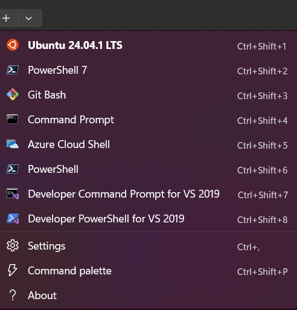
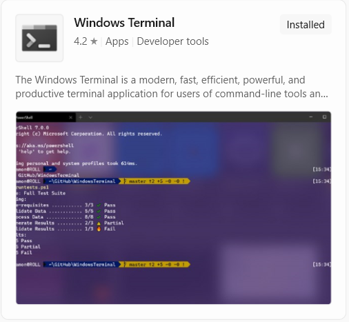
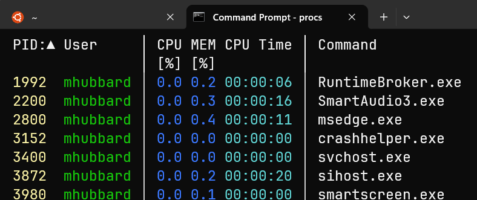
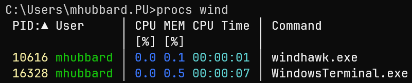
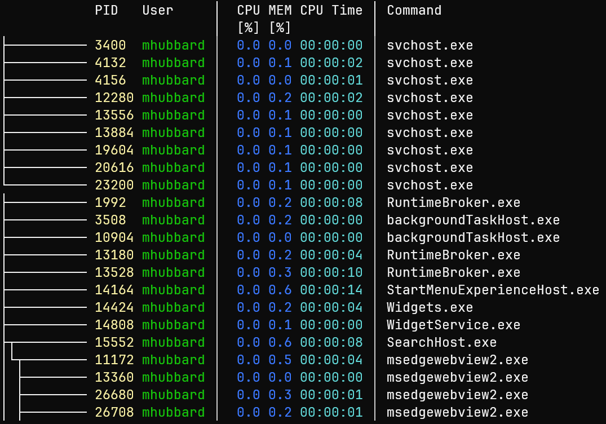

# Using PowerShell

----------------------------------------------------------------


----------------------------------------------------------------

Here are the steps I took to get Windows terminal installed, the latest version of PowerShell configured with history and some other Linux like features. Also the `procs` tool for viewing processes in a Unix like format.

## Getting Started

The first step is installing the Windows Terminal. While not strictly required, you could use the cmd.exe shell, I find the Windows Terminal a much better solution. It allows:

Multiple applications in one application

- PowerShell
- WSL
- Git Bash
- CMD.exe
- Azure Cloud Shell

Here is a screenshot of my Windows Terminal menu:

----------------------------------------------------------------


----------------------------------------------------------------

You can see that I have organized it so that Ubuntu 24.04 is at the top, then PowerShell 7, then Git Bash, then Command Prompt. The PowerShell without a number is the builtin version 5.1. Since I use WSL and PowerShell 7.5 the most, this makes sense for me. After we install PowerShell 7.5, I'll show you how to modify the order.

This article: [Windows Terminal vs. Command Prompt vs. PowerShell: Which Should You Use?](https://www.howtogeek.com/windows-terminal-vs-command-prompt-vs-powershell-what-to-use-when/) covers the differences between cmd.exe, powershell, wsl, and Windows Terminal. To sum up:

----------------------------------------------------------------

***Windows Terminal is the newest member of the group. Rather than being a shell itself, it serves as a modern interface for hosting multiple shells. You can run CMD, PowerShell, and even Linux distributions through Windows Subsystem for Linux (WSL) all within a single, customizable window. With features like tabs, Unicode support, and GPU-accelerated rendering, it makes multitasking smoother and more efficient.***

----------------------------------------------------------------

### Install Windows Terminal

Installing the Windows Terminal is simple.

- Click the start menu
- Type `microsoft store` and press `enter`
- Search for `Windows Terminal`
- Click on the `Free` button
- click on `Get`

----------------------------------------------------------------



----------------------------------------------------------------

### Install the latest version of PowerShell core

Windows 11 ships with PowerShell 5.1 installed. I don't understand all the reasons behind it, but PowerShell 7.5 is the latest version and it installs *BESIDE* PowerShell 5.1. That is really confusing and both versions store their `$PROFILE` in separate locations!

Open cmd.exe and paste the following code:

`winget install --id Microsoft.PowerShell --source winget`

This will install the latest version of PowerShell 7. If PowerShell 7 is already installed, it will fail and tell you to run upgrade instead.

In that case, run the following code to verify that PowerShell is up to date:

`winget upgrade --id Microsoft.PowerShell --source winget`

#### Check the Powershell version

Search `terminal` in Windows search bar and open it. Click the :material-chevron-down: in the top menu and select PowerShell. Once you are in the PowerShell terminal you can check the version with `$PSVersionTable`. Here is what the output looked like on my fresh install:

```text
(Discovery) PS C:\Users\mhubbard.PU\Documents\04_tools\Discovery> $PSVersionTable

Name                           Value
----                           -----
PSVersion                      7.5.1
PSEdition                      Core
GitCommitId                    7.5.1
OS                             Microsoft Windows 10.0.26100
Platform                       Win32NT
PSCompatibleVersions           {1.0, 2.0, 3.0, 4.0…}
PSRemotingProtocolVersion      2.3
SerializationVersion           1.1.0.1
WSManStackVersion              3.0
```

### Add a persistent history and command search

This is a must have feature and gives PowerShell some [zsh](https://github.com/ohmyzsh) like capabilities.

#### Create the PowerShell 7 profile

For some reason installing PowerShell 7 with winget didn't create the profile. We will use this PowerShell code to do it. Click on the `copy` icon on the right to copy the code and paste it into the PowerShell terminal:

```bash
if (!(Test-Path -Path $PROFILE)) {
    New-Item -ItemType File -Path $PROFILE -Force
}
```

You can see the path to the file by running:

```PowerShell hl_lines='1'
 echo $profile
C:\Users\mhubbard.PU\Documents\PowerShell\Microsoft.PowerShell_profile.ps1
```

!!! tip
    You can view all profiles that PowerShell 7 sees using

    ```bash
     $PROFILE | Select-Object *
      AllUsersAllHosts       : C:\Program Files\PowerShell\7\profile.ps1
      AllUsersCurrentHost    : C:\Program Files\PowerShell\7\Microsoft.PowerShell_profile.ps1
      CurrentUserAllHosts    : C:\Users\mhubbard.PU\OneDrive\Documents\PowerShell\profile.ps1
      CurrentUserCurrentHost : C:\Users\mhubbard.PU\OneDrive\Documents\PowerShell\Microsoft.PowerShell_profile.ps1
      Length                 : 83
    ```

We want to modify the profile. Open it using `notepad $PROFILE`. Then paste in the following:

```powershell linenums="1" hl_lines="1-5 7 12 15"
Import-Module PSReadLine
Set-PSReadLineOption -PredictionSource History
Set-PSReadLineOption -HistorySearchCursorMovesToEnd # Optional: moves cursor to end of matched command
Set-PSReadLineKeyHandler -Key UpArrow -Function HistorySearchBackward
Set-PSReadLineKeyHandler -Key DownArrow -Function HistorySearchForward

function Invoke-CsvLensWithArgs {
    csvlens.exe --color-columns --no-headers @args
}

# --- Custom aliases for Discovery tool ---
Set-Alias -Name cl -Value Invoke-CsvLensWithArgs
# --- End custom aliases for Discovery tool ---

 Invoke-Expression (& { (zoxide init powershell | Out-String) })

# Load persistent PSReadLine history into session memory
if (Test-Path (Get-PSReadlineOption).HistorySavePath) {
    Get-Content (Get-PSReadlineOption).HistorySavePath | ForEach-Object { Add-History $_ }
}
```

The first line imports the `PSReadLine` module. This tells PowerShell to read the history file.

The next 4 lines setup a history search capability. That is so useful, if you have typed a command previously, you just type the first few letters and tap the up arrow. It will cycle through all commands that match.

The `function Invoke-CsvLensWithArgs` creates an alias for csvlens that automatically adds the `--color-columns` and `--no-headers` needed to view the device inventory files.

!!! note
    If you installed PowerShell On Mac/Linux, use `csvlens --color-columns --no-headers @args` instead of `csvlens.exe --color-columns --no-headers @args`

The line `Set-Alias -Name cl -Value Invoke-CsvLensWithArgs`, builds the alias. In this case, typing `cl` invokes the alias.

Finally, the line `Invoke-Expression (& { (zoxide init powershell | Out-String) })` adds `zoxide` to the profile. Zoxide is a tool that builds a database of the directories you go to then allows you to `jump` to them with just a few keystrokes.

For example, once you have installed the scripts to the `Discovery` folder and navigated to them at least once you can just type `z dis` and it will jump you to the directory.

#### Load the history file

PowerShell's persistent history is primarily managed by the PSReadLine module. This module tracks the commands you enter and saves them to a history file.

You can enter `(Get-PSReadlineOption).HistorySavePath` to find the location of the history file.

**Windows**

For me, the file is located at `C:\Users\mhubbard.PU\AppData\Roaming\Microsoft\Windows\PowerShell\PSReadLine\ConsoleHost_history.txt`.

**Linux**

For me, the file is located at `/home/mhubbard/.local/share/powershell/PSReadLine/ConsoleHost_history.txt`.

When I closed PowerShell I lost the history. I did a bunch of `Gemini` searching and found you have to add some code to the `$profile` to make PowerShell display history from the previous session.

You can display history using:
`cat (Get-PSReadlineOption).HistorySavePath`

and search history using:
`cat (Get-PSReadlineOption).HistorySavePath | Select-String <Something>`

If you have been using a loaner laptop, you can delete the entire history file using:
`Remove-Item (Get-PSReadlineOption).HistorySavePath`

To make history persist across sessions open the $profile and paste this into the bottom of the file.

```bash linenums='1' hl_lines='2 20 49 54'
# Load previous persistent history into current session's Get-History list
function full-history {
    $historyPath = (Get-PSReadlineOption).HistorySavePath
    if (Test-Path $historyPath) {
        $lines = Get-Content $historyPath | Where-Object { $_.Trim() -ne "" }
        $index = 1
        $lines | ForEach-Object {
            [PSCustomObject]@{
                Line    = $index
                Command = $_
            }
            $index++
        } | Format-Table -AutoSize
    }
    else {
        Write-Host "No history file found."
    }
}

function Invoke-HistoryNumber {
    param(
        [Parameter(Position=0, Mandatory=$true)]
        [int]$LineNumber
    )

    $historyPath = (Get-PSReadlineOption).HistorySavePath
    if (-not (Test-Path $historyPath)) {
        Write-Host "History file not found."
        return
    }

    $lines = Get-Content $historyPath | Where-Object { $_.Trim() -ne "" }

    if ($LineNumber -lt 1 -or $LineNumber -gt $lines.Count) {
        Write-Host "Invalid line number: $LineNumber"
        return
    }

    $command = $lines[$LineNumber - 1]
    Write-Host "`n> $command`n"

    try {
        Invoke-Expression $command
    }
    catch {
        Write-Warning "Command failed: $_"
    }
}
Set-Alias ! Invoke-HistoryNumber

# Load previous session commands into PSReadLine session history
# ~/.config/powershell/Microsoft.PowerShell_profile.ps1 or $PROFILE

$ExecutionContext.InvokeCommand.PostCommandLookupAction = {
    # Only run this once
    if (-not $script:HistoryLoaded) {
        $script:HistoryLoaded = $true

        $historyPath = (Get-PSReadlineOption).HistorySavePath
        if (Test-Path $historyPath) {
            Get-Content $historyPath |
                Where-Object { -not [string]::IsNullOrWhiteSpace($_) } |
                ForEach-Object {
                    [Microsoft.PowerShell.PSConsoleReadLine]::AddToHistory($_)
                }
        }
    }
}
```

Close PowerShell and reopen it. type `full-history` to see history from all sessions. The :material-arrow-up: and  :material-arrow-down: keys will navigate through the history.

The code also adds line numbers link in Mac/Linux history.

----------------------------------------------------------------


----------------------------------------------------------------

### Install Zoxide

Zoxide works on Mac/Linux/Windows! The project is hosted on GitHub at [zoxide](https://github.com/ajeetdsouza/zoxide). To install on Windows:

```bash
winget install ajeetdsouza.zoxide
zoxide init powershell
```

The winget command does the install, the zoxide init powershell adds the line we saw above to the PowerShell profile. I cannot recommend `zoxide` enough.

----------------------------------------------------------------

### Install procs

[Procs](https://github.com/dalance/procs) is a modern replacement for venerable Linux/Unix `ps` command written in `rust`. It's cross platform and available for Mac/Linux and Windows.

**Features**

- Colored and human-readable output
    - Automatic theme detection based on terminal background
- Multi-column keyword search
- Some additional information which are not supported by ps
    - TCP/UDP port
    - Read/Write throughput
    - Docker container name
    - More memory information
- Pager support
- Watch mode (like top)
- Tree view

While not required, it's a nice tool and if you work on more than one OS it is nice to have common tools. Here is a screenshot of `procs` with no arguments:

----------------------------------------------------------------



----------------------------------------------------------------

**Search by non-numeric keyword**

If you include a nonnumeric keyword, only processes matching the keyword will be shown. For example, to find processes starting with `wind`:

`procs wind`

----------------------------------------------------------------



----------------------------------------------------------------

**Display dependencies in a tree view**

`procs --tree`

----------------------------------------------------------------



----------------------------------------------------------------

There are many more options for sorting, adding columns, viewing Docker containers, etc. Please visit the [Procs](https://github.com/dalance/procs) GitHub repo for full details.

#### Installation

From a `cmd.exe` shell, run:

`winget install procs`

You will need to close the terminal and reopen to use `procs`

----------------------------------------------------------------

### Change the order in Terminal

This is optional but if you use Windows Terminal often it's worth customizing the order that your shells are displayed in.

- Open Windows Terminal
- Click the :material-chevron-down: in the top menu
- Click `settings`
- Click `Open JSON File` at the very bottom, left of the terminal.

----------------------------------------------------------------


----------------------------------------------------------------

!!! Note
    On my Windows laptop, Windows Terminal always opens with the bottom of the terminal below the bottom of the screen. I couldn't see the Open JSON file option until dragging the window up. Holding `shift` while clicking the `X` to close hasn't resolved the issue.

Scroll down until you see

```bash
"list":
        [
            {
                "commandline": "%SystemRoot%\\System32\\WindowsPowerShell\\v1.0\\powershell.exe",
                "guid": "{61c54bbd-c2c6-5271-96e7-009a87ff44bf}",
                "hidden": true,
                "name": "Windows PowerShell 7"
            },
```

Your exact JSON will be different than mine so you will see something different. The important thing is finding `":list":` in the JSON file. Copy everything from `"list":` to the last `}` before the `]` symbol and save it to notepad++ or your favorite editor. Save a copy as a backup in case you make a mistake editing `settings.json`.

#### Move the shells

Now you can cut each shell and move it to the order you want. I renamed `Windows PowerShell` to `Windows PowerShell 7` so that it's obvious which version to select.  When you are satisfied, save and close the `settings.json` file.

Notice the `"hidden": true,` and `"hidden": false,` lines. I don't know why some shells have two entries with one hidden and one not.

Here is what my final JSON looks like:

```json linenums='1' hl_lines='6 11 17 23 29 35 41 47 53 59'
        "list":
        [
            {
                "commandline": "%SystemRoot%\\System32\\WindowsPowerShell\\v1.0\\powershell.exe",
                "guid": "{61c54bbd-c2c6-5271-96e7-009a87ff44bf}",
                "hidden": true,
                "name": "Windows PowerShell 7"
            },
            {
                "guid": "{d8e96812-b789-5068-a5ae-10b2fb53e95f}",
                "hidden": false,
                "name": "Ubuntu 24.04.1 LTS",
                "source": "CanonicalGroupLimited.Ubuntu24.04LTS_79rhkp1fndgsc"
            },
            {
                "guid": "{5fb123f1-af88-5b5c-8953-d14a8def1978}",
                "hidden": false,
                "name": "PowerShell 7",
                "source": "Windows.Terminal.PowershellCore"
            },
            {
                "guid": "{2ece5bfe-50ed-5f3a-ab87-5cd4baafed2b}",
                "hidden": false,
                "name": "Git Bash",
                "source": "Git"
            },
            {
                "commandline": "%SystemRoot%\\System32\\cmd.exe",
                "guid": "{0caa0dad-35be-5f56-a8ff-afceeeaa6101}",
                "hidden": false,
                "name": "Command Prompt"
            },
            {
                "guid": "{b453ae62-4e3d-5e58-b989-0a998ec441b8}",
                "hidden": false,
                "name": "Azure Cloud Shell",
                "source": "Windows.Terminal.Azure"
            },
            {
                "guid": "{574e775e-4f2a-5b96-ac1e-a2962a402336}",
                "hidden": false,
                "name": "PowerShell",
                "source": "Windows.Terminal.PowershellCore"
            },
            {
                "guid": "{963ff2f7-6aed-5ce3-9d91-90d99571f53a}",
                "hidden": true,
                "name": "Ubuntu-24.04",
                "source": "Windows.Terminal.Wsl"
            },
            {
                "guid": "{43a35048-5e42-5c40-8a75-f5b7bfec7d65}",
                "hidden": false,
                "name": "Developer Command Prompt for VS 2019",
                "source": "Windows.Terminal.VisualStudio"
            },
            {
                "guid": "{b7ba4424-3cd0-5300-927c-57d95790a11f}",
                "hidden": false,
                "name": "Developer PowerShell for VS 2019",
                "source": "Windows.Terminal.VisualStudio"
            }
        ]
```
