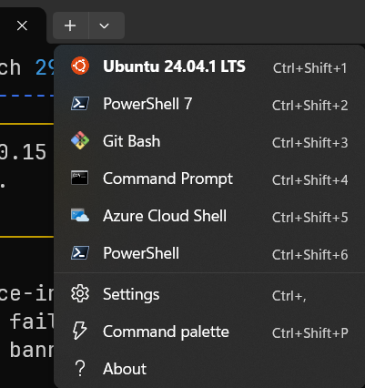

# Using PowerShell

----------------------------------------------------------------


----------------------------------------------------------------

Here are the steps I took to get Windows terminal installed and the latest version of PowerShell configured with history and some other Linux like features.

## Getting Started

The first step is installing the Windows Terminal. While not strictly required, you could use the cmd.exe shell, I find the Windows Terminal a much better solution. It allows:

Multiple applications in one application

- PowerShell
- WSL
- Git Bash
- CMD.exe
- Azure Cloud Shell

Here is a screenshot of my terminal:

----------------------------------------------------------------


----------------------------------------------------------------

You can see that I have organized it so that Ubuntu 24.04 is at the top, then PowerShell 7, then Git Bash, then Command Prompt. The PowerShell without a number is the builtin version 5.1. Since I use WSL and PowerShell 7.5 the most, this makes sense for me. After we install PowerShell 7.5, I'll show you how to modify the order.

### Install the latest version of PowerShell core

Windows 11 ships with PowerShell 5.1 installed. I don't understand all the reasons behind it, but PowerShell 7.5 is the latest version and it installs *BESIDE* PowerShell 5.1. That is really confusing and both versions store there `$PROFILE` in separate locations!

Open cmd.exe and paste the following code:

`winget install --id Microsoft.PowerShell --source winget`

This will install the latest version of PowerShell 7. If PowerShell 7 is already installed, it will fail and tell you to run upgrade instead.

In that case, run the following code to verify that PowerShell is up to date:

`winget upgrade --id Microsoft.PowerShell --source winget`

#### Check the Powershell version

Search PowerShell in Window search bar and open it. Once you are in the PowerShell terminal you can check the version with `$PSVersionTable`. Here is what the output looked like on my fresh install:

```text
(Discovery) PS C:\Users\mhubbard.PU\Documents\04_tools\Discovery> $PSVersionTable

Name                           Value
----                           -----
PSVersion                      7.5.1
PSEdition                      Core
GitCommitId                    7.5.1
OS                             Microsoft Windows 10.0.26100
Platform                       Win32NT
PSCompatibleVersions           {1.0, 2.0, 3.0, 4.0…}
PSRemotingProtocolVersion      2.3
SerializationVersion           1.1.0.1
WSManStackVersion              3.0
```

### Add a persistent history and command search

This is a must have feature and gives PowerShell some [zsh](https://github.com/ohmyzsh) like capabilities. First we will open the PowerShell configuration file.

#### Create the PowerShell 7 profile

For some reason installing PowerShell 7 with winget didn't create the profile. We will use this PowerShell code to do it:

```text
```

You can see the path to the file by running:

```PowerShell
 echo $profile
C:\Users\mhubbard.PU\Documents\PowerShell\Microsoft.PowerShell_profile.ps1
```

We want to modify the profile. Open it using `notepad $PROFILE`. Then paste in the following:

```powershell linenums="1" hl_lines="1-5 7 12 15"
Import-Module PSReadLine
Set-PSReadLineOption -PredictionSource History
Set-PSReadLineOption -HistorySearchCursorMovesToEnd # Optional: moves cursor to end of matched command
Set-PSReadLineKeyHandler -Key UpArrow -Function HistorySearchBackward
Set-PSReadLineKeyHandler -Key DownArrow -Function HistorySearchForward

function Invoke-CsvLensWithArgs {
    csvlens.exe --color-columns --no-headers @args
}

# --- Custom aliases for Discovery tool ---
Set-Alias -Name cl -Value Invoke-CsvLensWithArgs
# --- End custom aliases for Discovery tool ---

 Invoke-Expression (& { (zoxide init powershell | Out-String) })
```

The first line imports the `PSReadLine` module. This tells PowerShell to read the history file. I did a bunch of Gemini searching and PowerShell still isn't displaying history from the previous session. In other words, when I close PowerShell I lose the history.

The next 4 lines setup a history search capability. That is so useful, if you have typed a command previously, you just type the first few letters and tap the up arrow. It will cycle through all commands that match.

The `function Invoke-CsvLensWithArgs` creates an alias for csvlens that automatically adds the `--color-columns` and `--no-headers` needed to view the device inventory files.

The line `Set-Alias -Name cl -Value Invoke-CsvLensWithArgs`, builds the alias. In this case, typing `cl` invokes the alias.

Finally, the line `Invoke-Expression (& { (zoxide init powershell | Out-String) })` adds `zoxide` to the profile. Zoxide is a tool that builds a database of the directories you go to then allows you to `jump` to them with just a few keystrokes.

For example, once you have installed the scripts to the `Discovery` folder and navigated to them at least once you can just type `z dis` and it will jump you to the directory.

### Install Zoxide

Zoxide works on Mac/Linux/Windows! The project is hosted on GitHub at [zoxide](https://github.com/ajeetdsouza/zoxide). To install on Windows:

```text
winget install ajeetdsouza.zoxide
zoxide init powershell
```

The winget command does the install, the zoxide init powershell adds the line we saw above to the PowerShell profile. I cannot recommend `zoxide` enough.
