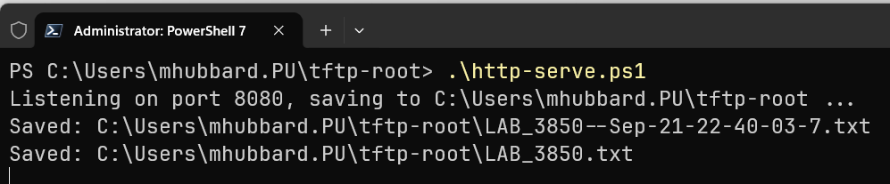
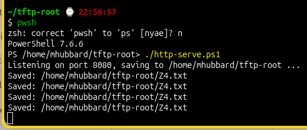

# Daily Switch Backup via TFTP and Cisco kron

A lighter-weight alternative to [Automating Discovery](appendix-discovery-automation.md)
for a customer who just wants a daily plaintext copy of every switch's
running-config — no Discovery repo clone, no Python `venv`, no git commits.
It only needs a TFTP server on the automation host and a few lines of
`kron` (Cisco IOS's built-in job scheduler) on each switch.

You can also skip the Ubuntu VM and use PowerShell on Windows/Mac/Linux. See [PowerShell Alternative: HTTP Instead of TFTP](appendix-daily-switch-backup.md#powershell-alternative-http-instead-of-tftp)

----------------------------------------------------------------

## Why this exists

Built at a real customer engagement — the same site (`jc`) used throughout
these appendices — before the [Automating Discovery](appendix-discovery-automation.md) tooling existed. `kron` is IOS-specific, and this approach doesn't discover anything: no port maps, no MAC/IP tracking over time, just a daily `show run` backup per switch. For a customer who doesn't want daily git commits or Python tooling on their automation VM, that's often all they actually want.

This VM is a good candidate to become a jump box — see
[Restricting SSH on the Automation Host](appendix-jump-box-hardening.md).
Restricting logins to a management subnet or a short trusted-host list,
instead of leaving SSH open to the whole network, is worth doing here even
if the customer never runs the full
[Automating Discovery](appendix-discovery-automation.md) setup. For a
customer working toward CMMC, or similar compliance requirements,
this is a reasonable first step — not the whole story, but a real one.

[Termius](https://docs.termius.com/) (subscription required) is worth a
mention as a client — it makes managing switches and servers a
more pleasant experience than juggling separate terminal windows. The subscription gives you the ability to install `Termius` on:

- Windows
- Mac
- Linux
- IOS
- Android

It's great if you are in a closet and need to make a quick change and only have your phone with you!

----------------------------------------------------------------

## Set up the VM

This appendix assumes a small Ubuntu 26.04 desktop VM at the site — not
your own Windows workstation. Hyper-V, ESXi, KVM, Proxmox — doesn't matter
what hosts it.

Here is an example:

- **OS**: Ubuntu 26.04 Desktop (on Hyper-V)
- **Hostname:** Discover
- **IP address**: 10.100.126.100
- **Username**: mhubbard

If the customer doesn't already have one, stand up an Ubuntu 26.04 desktop
VM first, replacing `mhubbard`, `discover`, and `10.100.126.100` with
values for your customer.

Open a terminal, `ctrl+alt+t`, then update the package repositories:

```bash
sudo apt update
```

If this is a new install you'll probably see packages that need updating
once that finishes:

```bash
sudo apt upgrade -y
```

Install `openssh-server` for remote management — not included in an
Ubuntu Desktop install by default:

```bash
sudo apt install openssh-server -y
```

## 1. Install and configure the TFTP server

The server package is `tftpd-hpa` — not `tftp-hpa`, which is the client:

```bash
sudo apt update
sudo apt install tftpd-hpa -y
```

Some `tftpd-hpa` packages sandbox the service with `ProtectHome=yes` in
their systemd unit, which makes `/home`, `/root`, and `/run/user`
**completely inaccessible** to the daemon — not a permissions issue, an
outright block, independent of `TFTP_DIRECTORY` or any `in.tftpd` flag.
Check this — and fix it if needed — before enabling the service, so it
only ever starts once, already configured correctly:

```bash
sudo systemctl edit tftpd-hpa
```

On Ubuntu 26.04 this opens an editor with a blank area at the top to type
into, followed by a large read-only reference dump of the unit's current
settings — including a `# ProtectHome=yes` line — clearly marked as
existing only for reference. **Don't edit anything in that reference
section** — `systemctl` detects changes made there as "modifications
outside of the staging area," discards them, and if that leaves the actual
editable area empty, cancels the whole edit without writing anything
(confirmed the hard way: editing that line in place produced exactly that
error and silently wrote nothing).

Instead, type a brand new override into the blank area at the top:

```ini
[Service]
ProtectHome=no
```

Save and exit — `systemctl edit` reloads the unit automatically, no
separate `daemon-reload` needed.

If `ProtectHome` doesn't appear anywhere in that reference dump, close
without saving — a home-directory `TFTP_DIRECTORY` will already work,
nothing to override.

Config file is `/etc/default/tftpd-hpa`:

```bash
sudo nano /etc/default/tftpd-hpa
```

```text
TFTP_USERNAME="tftp"
TFTP_DIRECTORY="/home/mhubbard/tftp-root"
TFTP_ADDRESS=":69"
TFTP_OPTIONS="--secure"
```

Use the real absolute path here, not a literal `~` — systemd never expands
that regardless of directory. A customer-facing home-directory location is
worth the override above: most customers can't navigate to `/srv`, but
they can open **Files** and find `tftp-root` right under their home folder.

Now enable and start the service:

```bash
sudo systemctl enable --now tftpd-hpa
```

Confirm it's running:

```bash
systemctl status tftpd-hpa
```

## 2. Open the firewall and pre-create each switch's backup file

TFTP has to have an existing filename with the correct permissions before
it will write to it — confirmed straight from `man in.tftpd`:

> By default, tftpd will only allow upload of files that already exist ...
> Files may be written only if they already exist and are publicly
> writable, unless the `--create` option is specified.

`ufw_add_switches.sh` handles both requirements from one pass over one
file: it opens port 69/udp (TFTP) for a switch's management IP, so nothing
else on the LAN can reach the TFTP service, and creates + `chmod 666`s that
switch's backup file at the same time. Only 69/udp is needed — TFTP has no
relation to FTP's port 21, despite the similar name.

There's no repo to clone this out of, so create it directly:

```bash
cd ~
touch ufw_add_switches.sh
nano ufw_add_switches.sh
```

Paste the following into nano, then `ctrl+o` to save, `ctrl+x` to close it:

```bash
#!/bin/bash
# Open UFW for TFTP (port 69/udp) from a list of switch management IPs, and
# pre-create the matching TFTP backup file (chmod 666) for each one so the
# first kron push doesn't fail on a missing file.
#
# Reads "ip,filename" pairs from tftp-switches.txt (one per line, blank
# lines and lines starting with # ignored) so a customer never has to edit
# this script itself, just the IP/filename list.

set -e

FILE="${1:-tftp-switches.txt}"
TFTP_ROOT="${TFTP_ROOT:-$HOME/tftp-root}"

if [[ ! -f "$FILE" ]]; then
  echo "Missing $FILE - create it with one 'ip,filename' pair per line" >&2
  exit 1
fi

# A brand-new Ubuntu install ships ufw installed but inactive. Allow SSH
# before enabling it so this doesn't cut off a remote session running over
# the same connection that's executing this script. --force skips ufw's
# interactive "this may disrupt existing ssh connections" confirmation,
# which would otherwise hang a non-interactive run.
sudo ufw allow ssh
sudo ufw --force enable

while IFS=',' read -r ip filename; do
  ip="$(echo "$ip" | xargs)"
  [[ -z "$ip" || "$ip" == \#* ]] && continue
  filename="$(echo "$filename" | xargs)"
  if [[ -z "$filename" ]]; then
    echo "Missing filename for $ip in $FILE - each line needs 'ip,filename'" >&2
    exit 1
  fi

  sudo ufw allow from "$ip" to any port 69 proto udp
  touch "$TFTP_ROOT/$filename"
  chmod 666 "$TFTP_ROOT/$filename"
done < "$FILE"

# Reload rules to apply
sudo ufw reload

# Show the resulting ruleset, rules sorted numerically by source IP.
# Capturing to a variable first, rather than piping head and tail off the
# same stream, avoids head consuming input tail still needs - a real,
# reproducible gotcha when both read from one pipe. Named ufw_status rather
# than status, since status is a read-only special variable in zsh (aliases
# $?) - fine under this script's own #!/bin/bash, but a landmine if it's
# ever sourced into a zsh shell instead of executed.
#
# Sorting by a fixed field number (e.g. sort -k6,6) doesn't work: ufw right
# -pads single-digit rule numbers with a space ("[ 4]", two tokens) but not
# double-digit ones ("[10]", one token), so every field after it shifts by
# one once rule numbers reach 10 - confirmed on a real box with 16 rules.
# Finding whichever field actually looks like an IPv4 address sidesteps
# that entirely, regardless of rule-number width.
ufw_status="$(sudo ufw status numbered)"
echo "$ufw_status" | head -4
echo "$ufw_status" | tail -n +5 | awk '{
  key = ""
  for (i = 1; i <= NF; i++) {
    if ($i ~ /^[0-9]{1,3}(\.[0-9]{1,3}){3}$/) { key = $i; break }
  }
  print key "\t" $0
}' | sort -k1,1 -V | cut -f2-
```

```bash
chmod +x ufw_add_switches.sh
```

That `sudo ufw allow ssh` inside the script is deliberately wide open —
just enough to guarantee `ufw enable` doesn't lock out the session running
it. Once everything below is working, see
[Restricting SSH on the Automation Host](appendix-jump-box-hardening.md) to
scope that down; the TFTP rules this script adds are already
per-switch-IP, but SSH is left open to the whole LAN until that's done.

Both come from `tftp-switches.txt` — `ip,filename` pairs, one per line,
blank lines and `#` comments ignored — so a customer never has to edit the
script itself, just this list:

```bash
cat > tftp-switches.txt << 'EOF'
10.100.126.253,JC-core.wri
10.100.126.236,JC-IDF-1.wri
10.100.126.237,JC-IDF-2.wri
10.100.126.242,JC-IDF-CAM-1.wri
10.100.126.231,JC-MDF-1.wri
10.100.126.232,JC-MDF-2.wri
10.100.126.243,JC-MDF-3.wri
10.100.126.235,JC-MDF-4.wri
10.100.126.241,JC-MDF-CAM-1.wri
10.100.126.238,JC-MDF-CAM-2.wri
10.100.126.244,JC-SPARE.wri
EOF

./ufw_add_switches.sh tftp-switches.txt
```

----------------------------------------------------------------

Alternatively, open the GUI text editor and create tftp-switches.txt.

----------------------------------------------------------------

```bash linenums='1' hl_lines='1'
sudo ./ufw_add_admins.sh ufw-admins.txt
```

----------------------------------------------------------------

```bash title='Command Output'
Rule added
Rule added
Rule added
Firewall reloaded
Status: active

     To                         Action      From
     --                         ------      ----
[ 3] 22/tcp                     ALLOW IN    192.168.10.143             # G5-wireless-admin-ssh
[ 4] 22/tcp                     ALLOW IN    192.168.10.223             # Ubuntu-Server-admin-ssh
[ 2] 69/udp                     ALLOW IN    192.168.10.253
[ 5] 22/tcp                     ALLOW IN    192.168.10.253             # 3850-admin-ssh
[ 1] 22/tcp                     ALLOW IN    Anywhere
[ 6] 22/tcp (v6)                ALLOW IN    Anywhere (v6)
```

----------------------------------------------------------------

!!! note
    Notice that the `ssh any` is gone. If you are running this over ssh, make sure the device you are on is in the list or you will be locked out.

Now you can use the `ufw_check.sh` script to view the tftp and ssh rules:

```bash linenums='1' hl_lines='1'
sudo ./ufw_check.sh
```

```bash title='Command Output'
===UFW Service State (systemd)===
Service enabled: enabled
Service state  : active
Firewall state : Status: active

Status: active

     To                         Action      From
     --                         ------      ----
[ 3] 22/tcp                     ALLOW IN    192.168.10.143             # G5-wireless-admin-ssh
[ 4] 22/tcp                     ALLOW IN    192.168.10.223             # Ubuntu-Server-admin-ssh
[ 2] 69/udp                     ALLOW IN    192.168.10.253
[ 5] 22/tcp                     ALLOW IN    192.168.10.253             # 3850-admin-ssh
[ 1] 22/tcp                     ALLOW IN    Anywhere
[ 6] 22/tcp (v6)                ALLOW IN    Anywhere (v6)
```

----------------------------------------------------------------

`man in.tftpd` only requires the files be *writable*, and `666` is what
the script uses — confirmed working in production, not just the
theoretical minimum from the man page. It also doesn't set the execute
bit `777` would, which these plaintext config backups never need.

!!! note "Why not just add --create instead?"
    `in.tftpd`'s `--create` flag exists specifically to let it write brand
    new files, which sounds like it should remove this whole step — and
    once the `ProtectHome=no` override above is in place, it genuinely
    would (confirmed on a fresh Ubuntu 26.04 install). The reason to skip
    it anyway is security, not uncertainty: without `--create`, TFTP can
    only ever *overwrite* one of the specific files pre-created here — it
    can't be handed a brand new filename by anyone who reaches port 69.
    A switch inventory is fairly static, so pre-creating one file per
    switch, once, is cheap insurance against an unlikely but real class of
    attack: something on the LAN pushing an arbitrary file to this host
    under a name nothing here is watching for.

If this same automation host also runs the git-based
[Automating Discovery](appendix-discovery-automation.md) setup, add
`tftp-switches.txt` to `.gitignore` alongside `vlans.txt` — it's
site-specific data, not something to commit.

----------------------------------------------------------------

## 3. Schedule the backup on each switch (Cisco kron)

```text
kron occurrence WrConfig_Job at 22:30 recurring
 policy-list Write_Config
!
kron policy-list Write_Config
 cli wr mem
 cli show run | redirect tftp://10.100.126.100/JC-MDF-1.wri
!
```

- `kron occurrence <name> at <time> recurring` — schedules a named job daily
  at that time.
- `policy-list <name>` under the occurrence — which set of commands to run.
- `kron policy-list <name>` defines that set: `cli wr mem` saves the running
  config to NVRAM first (so a reload before the next backup doesn't lose
  in-flight changes), then `cli show run | redirect tftp://<host>/<file>`
  pushes the running-config text straight to the TFTP server.

Repeat per switch with the matching filename from step 2, and a distinct
occurrence name if you'd rather not have every switch push in the same
second.

## 4. Verify and monitor

One script, `ufw_check.sh`, covers both an ad-hoc interactive check and a
scheduled audit trail — without `--log`, it just prints UFW's current state; with `--log`, it also appends a timestamped, session-ID'd snapshot to
`/var/log/ufw-check.log`. Create it the same way:

```bash
cd ~
touch ufw_check.sh
nano ufw_check.sh
```

```bash
#!/bin/bash
# Check UFW service and firewall status together. Plain, for an ad-hoc
# interactive check. With --log, also appends a timestamped, session-ID'd
# snapshot to /var/log/ufw-check.log - run it that way from cron for a
# running audit trail of whether the firewall stayed enabled and
# configured as expected.

if [[ $EUID -ne 0 ]]; then
  echo "This script needs root - run it with sudo." >&2
  exit 1
fi

LOGFILE="/var/log/ufw-check.log"
log_mode=false
[[ "$1" == "--log" ]] && log_mode=true

svc_enabled=$(systemctl is-enabled ufw 2>/dev/null)
svc_state=$(systemctl is-active ufw 2>/dev/null)
fw_state=$(ufw status | grep -i "Status:")

if $log_mode; then
  session_id="$(date +%Y%m%d%H%M%S)-$RANDOM"
  echo "=== UFW Audit Check ==="
  echo "Session ID: $session_id"
  echo "Timestamp : $(date '+%Y-%m-%d %H:%M:%S')"
else
  echo "===UFW Service State (systemd)==="
fi

echo "Service enabled: $svc_enabled"
echo "Service state  : $svc_state"
echo "Firewall state : $fw_state"

# Show the actual ruleset too, not just the summary above - sorted
# numerically by source IP rather than by ufw's own rule numbers. Same
# approach as ufw_add_switches.sh: ufw right-pads single-digit rule
# numbers with a space ("[ 4]", two tokens) but not double-digit ones
# ("[10]", one token), so a fixed field number shifts once rule numbers
# reach 10 - finding whichever field looks like an IPv4 address sidesteps
# that regardless of rule-number width.
echo
ufw_status="$(ufw status numbered)"
echo "$ufw_status" | head -4
echo "$ufw_status" | tail -n +5 | awk '{
  key = ""
  for (i = 1; i <= NF; i++) {
    if ($i ~ /^[0-9]{1,3}(\.[0-9]{1,3}){3}$/) { key = $i; break }
  }
  print key "\t" $0
}' | sort -k1,1 -V | cut -f2-

if $log_mode; then
  {
    echo "[$(date '+%Y-%m-%d %H:%M:%S')] Session $session_id"
    echo "  Service enabled: $svc_enabled"
    echo "  Service state  : $svc_state"
    echo "  Firewall state : $fw_state"
    echo "----------------------------------------"
  } >> "$LOGFILE"
fi
```

```bash
chmod +x ufw_check.sh
```

It needs root either way — checking UFW's own status, and (with `--log`)
writing to `/var/log/ufw-check.log`, both require it:

```bash
sudo ./ufw_check.sh
```

```bash title='Command Output'
===UFW Service State (systemd)===
Service enabled: enabled
Service state  : active
Firewall state : Status: active

Status: active

     To                         Action      From
     --                         ------      ----
[ 2] 69/udp                     ALLOW IN    192.168.10.253
[ 1] 22/tcp                     ALLOW IN    Anywhere
[ 3] 22/tcp (v6)                ALLOW IN    Anywhere (v6)
```

----------------------------------------------------------------

Prints the service/firewall summary followed by the actual ruleset — the
log file only ever gets the summary lines, not a full rule dump each run,
to keep it from growing unbounded on a frequent cron schedule.

Run without `sudo`, it fails cleanly instead of printing partial, confusing
output:

```text
$ ./ufw_check.sh
This script needs root - run it with sudo.
```

For a running audit trail, schedule the `--log` form in cron (root's
crontab, via `sudo crontab -e`):

```bash
0 6 * * * /path/to/ufw_check.sh --log
```

----------------------------------------------------------------

## PowerShell Alternative: HTTP Instead of TFTP

Most customers running an automation host use Windows, not Ubuntu, and
Windows has no built-in TFTP server. It doesn't need one, though — Cisco
IOS supports pushing config over plain HTTP as well as TFTP, and
PowerShell can receive that with a few lines of script, no extra software
to install.

----------------------------------------------------------------

### Schedule the backup on each switch (Cisco kron, HTTP version)

This configuration creates a backup with the filename LAB_3850.txt.

Real config from a lab 3850, `sh run | sec kron`:

```text
kron occurrence WrConfig_Job at 21:00 recurring
 policy-list Write_Config
kron occurrence Undebug_Job at 22:00 recurring
 policy-list Undebug
kron policy-list Write_Config
 cli wr mem
 cli copy running-config http://192.168.10.104:8080/LAB_3850.txt
kron policy-list Undebug
 cli und all
```

Same `cli wr mem`-first pattern as the TFTP version — only the transport
line changes: `cli copy running-config http://<host>:8080/<file>` in place
of `cli show run | redirect tftp://<host>/<file>`.

This backs up the running config with the filename LAB_3850.txt. It overwrites the previous backup.

----------------------------------------------------------------

### Backup with a time/date stamp

Cisco IOS also supports an `archive` section. I always include at least these commands in the `archive:

```bash linenums='1'
archive
 log config
  logging enable
  logging size 1000
```

- **log config** - Enters the config-change logging submode, which controls how IOS logs individual configuration commands as they're entered (separate from the archive-file feature itself)
- **logging enable** - Turns on logging of configuration changes. Every config command entered by any user gets logged with a sequence number, timestamp, and the user who made the change. You'd view this with show archive log config all
- **logging size 1000** - Sets the size of the config-change log buffer to 1000 entries (default is usually 100). Once full, older entries roll off
- **path** http://192.168.10.104:8080/\$h-\$t.txt - This is back at the top-level archive mode (not inside log config) — it defines where archived copies of the config get saved. Here it's pointed at an HTTP server at 192.168.10.104:8080.
  - $h = the router's hostname
  - $t = a timestamp

Here are the protocols that archive supports:

```bash linenums='1' hl_lines='1'
(config-archive)#path ?
  crashinfo:  Write archive on crashinfo: file system
  flash:      Write archive on flash: file system
  ftp:        Write archive on ftp: file system
  http:       Write archive on http: file system
  https:      Write archive on https: file system
  rcp:        Write archive on rcp: file system
  scp:        Write archive on scp: file system
  sftp:       Write archive on sftp: file system
  tftp:       Write archive on tftp: file system
```

----------------------------------------------------------------

If you are making a lot of changes to the network, say adding a new vlan for segmentation or migrating to a new VoIP platform, it makes sense to do the backup with time/date so you can roll back day by day if something goes wrong. Just make sure that you keep an eye on disk storage.

!!! note
    I set this up for a large school district with 86 sites and over 2,000 switches. They had me point it to a Windows server. I asked them to spin up an Ubuntu VM on their substantial ESXi infrastructure in case they got ransomware. They laughed, and then they got ransomed. No access to the backups. And I had included their Cisco WLAN controllers. They went for full backup of infrastructure to zero backup in one day.

Backup with time/date - Add the path command using your IP address.

```bash linenums='1'
archive
 log config
  logging enable
  logging size 1000
 path http://192.168.10.104:8080/$h-$t.txt
```

----------------------------------------------------------------

Then add this command to the kron policy:

```bash linenums='1' hl_lines='1'
 cli archive config
```

after the `cli show run | redirect tftp://192.168.10.223/3850.txt` line.

The `cli archive config` in the kron policy executes the `path` command in the Archive.

----------------------------------------------------------------



----------------------------------------------------------------

In the above screenshot, I have:

```bash linenums='1'
cli copy running-config http://192.168.10.104:8080/LAB_3850.txt
```

In the `kron' policy` and the `path` in the archive. You don't need both, this is just an example showing both formats. If you just use:

```bash linenums='1'
cli copy running-config http://192.168.10.104:8080/LAB_3850.txt
```

It is overwritten every day.

----------------------------------------------------------------

### Archive logging

With the `archive log` commands you can show who did what on the switch. Twice I have had a customer accuse me of breaking something. Luckily, I had the logging configured and had them run:

```bash linenums='1' hl_lines='1'
show archive log conf all
```

```bash title='show archive log conf all'
 idx   sess           user@line      Logged command
    1     1       mhubbard@vty1     |  logging enable
    2     1       mhubbard@vty1     |  logging size 1000
    3     1       mhubbard@vty1     |  path http://192.168.10.104:8080/$h-$t.txt
    4     0       mhubbard@vty0     |vlan 12
    5     0       mhubbard@vty0     | name Mitel-VoIP
    6     0       mhubbard@vty0     | interface Vlan12
    7     0       mhubbard@vty0     | ip address 192.168.12.1 255.255.255.0
    8     0       mhubbard@vty0     | no ip redirects
    9     0       mhubbard@vty0     | ip pim sparse-dense-mode
   10     0       mhubbard@vty0     | ipv6 address dhcp
   11     0       mhubbard@vty0     | ipv6 enable
   12     0       mhubbard@vty0     | ipv6 nd managed-config-flag
   13     0       mhubbard@vty0     | ipv6 nd other-config-flag
   14     0       mhubbard@vty0     | ipv6 nd router-preference High
   15     0       mhubbard@vty0     | ipv6 nd ra interval 30
   16     0       mhubbard@vty0     | ipv6 nd ra dns server FD24:42B2:12CE::1
```

That kind of audit trail is only as trustworthy as the credentials
protecting enable mode — see Type 5 vs. Type 9 secrets below for why that's worth checking on every device.

----------------------------------------------------------------

Type 5 vs. Type 9 secrets — why this matters for archive logging

The archive log config output above shows exactly what changed and
who changed it — but that log is only half the story if the enable
secret itself is weak. A show archive log config all audit trail
doesn't help you much if an attacker with a config backup can just crack
their way into enable mode and start making changes of their own.

Cisco's older enable secret hashing (type 5, MD5-crypt) is fast to
attack — genuinely fast. On a customer engagement at a California
community college district, I was handed a config backup after an
incident with no idea what the enable password was. I ran hashcat
against it with the RockYou word list on a laptop — no GPU — and had the
password back in 2 minutes, 29 seconds. That's type 5's real-world
exposure: if the password is anywhere in a common word list, cracking it
isn't a matter of hours or days, it's a coffee break.

Type 9 (enable secret using scrypt) is a different animal. It's
deliberately slow and memory-hard, specifically to make word list and
brute-force attacks impractical even with GPU acceleration. The same
attack that took under three minutes against type 5 wouldn't get
anywhere close against a decent type 9 password in any realistic
timeframe.

Action item: audit every device and convert type 5 to type 9.

Check what you're running:

```bash
show running-config | include enable secret
```

If you see enable secret 5 $1$..., convert it:

```bash
configure terminal
enable algorithm-type scrypt secret <new-password>
```

A few notes:

This requires a new password, not an in-place re-hash — IOS can't
reverse a type 5 hash to re-encode it as type 9, so this is a real
password change, not just a format upgrade. Plan for that across
however many devices you're touching.

Algorithm-type scrypt requires a reasonably current IOS release —
confirm support before rolling this out across older gear. This applies to enable secret specifically. username `<user>` secret
supports the same algorithm-type scrypt option and is worth checking
at the same time.

Don't stop at just the secret — a type 5 hash sitting in old backups,
TFTP dumps, or archive snapshots is still crackable even after
you've rotated the live config. If you're archiving configs long-term
(see the time/date-stamped backups above), treat old backups as
sensitive artifacts, not just historical records. I usually replace the hash with `<removed>` in old configs.

----------------------------------------------------------------

### Removing hashes from archives

Mac/Linux have `sed` built in. If you're on Windows, see [Install Coreutils for Windows](Getting_Started.md#install-coreutils-for-windows) to get native versions of these tools.

Converting the live `enable secret` to type 9 fixes the device going
forward, but it doesn't touch anything already sitting in an `archive`, TFTP, or HTTP-pushed backup history. Every timestamped snapshot taken before the conversion still has the old type 5 hash in it — and as the 2-minutes-29-seconds example above shows, that hash doesn't need to be recent to be dangerous. If you're keeping long-term config history for rollback purposes, it's worth sweeping it for exposed type 5 hashes rather than leaving them sitting around indefinitely.

Type 5 hashes always follow a fixed `$1$salt$hash` format, so you can
match the hash itself directly with `sed` — this works regardless of
whether it shows up under `enable secret 5`, `username ... secret 5`,
or a VTY `password 5` line:

**Preview only — print just the lines that would change, with the
hash already replaced, without touching the file:**

```bash
sed -nE 's/\$1\$[A-Za-z0-9.\/]+\$[A-Za-z0-9.\/]+/<removed>/gp' config-backup.txt
```

----------------------------------------------------------------

Real example from a customer archive

```bash
sed -nE 's/\$1\$[A-Za-z0-9.\/]+\$[A-Za-z0-9.\/]+/<removed>/gp'  jc-mdf-1-running-config.txt
```

----------------------------------------------------------------

```bash title='Type 5 hash removed'
enable secret 5 <removed>
username mhubbard privilege 15 secret 5 <removed>
username admin privilege 15 secret 5 <removed>
```

**In-place edit, keeping a `.bak` of the original (Linux/GNU sed):**

```bash
sed -E -i.bak 's/\$1\$[A-Za-z0-9.\/]+\$[A-Za-z0-9.\/]+/<removed>/g' config-backup.txt
```

**Bulk redaction across an entire archive directory:**

```bash
find /path/to/archive -type f -name '*.txt' -exec sed -E -i.bak 's/\$1\$[A-Za-z0-9.\/]+\$[A-Za-z0-9.\/]+/<removed>/g' {} +
```

!!! note

    macOS/BSD `sed` needs a space between `-i` and the backup suffix:
    `sed -E -i '.bak' '...' file` — the GNU form above (`-i.bak`, no space)
    will error out on a Mac.

    This only targets type 5 (`$1$`). If you're standardizing on type 9
    everywhere and want older archives fully consistent, type 8 and type 9
    hashes use `$8$` and `$9$` respectively — same pattern, just swap the
    literal prefix.

----------------------------------------------------------------

### No file pre-creation needed

TFTP's "the file has to already exist" rule (see step 2 above) is a
`tftpd-hpa` behavior, not a protocol requirement — Windows enforces nothing
of the kind, and the listener script below will happily create whatever
filename a switch pushes. That's also the tradeoff: unlike the TFTP setup,
there's no equivalent safety net limiting writes to a pre-approved list of
filenames. The script below narrows the *where* instead (see the
`GetFileName()` note in it), but not the *what*.

### Create the listener script

There's no repo to clone this out of either — create it directly. Make a
folder for it first — `tftp-root` to match the Linux side, though the name
is just organizational now, nothing reads it — then, inside that folder,
open Notepad, paste the script below, and **File → Save As**, set **Save
as type** to **All Files**, and name it `http-serve.ps1` (Notepad defaults
to `.txt`, which would leave you with `http-serve.ps1.txt` instead).
Backups land in this same folder — wherever the script itself is saved.

```powershell
# Receives Cisco config backups pushed via `copy running-config http://...`
# and writes them into the same folder this script itself lives in,
# cleaning up the numeric suffix IOS appends to the URL path (observed on
# a real 3850: a push to ".../x.txt" arrives with a URL path ending
# "x.txt-321" - the trailing "-NNN" gets moved to just before the
# extension: "x-321.txt").
#
# On Windows, run this from an elevated (Administrator) PowerShell.
# HttpListener refuses to bind a wildcard prefix like "http://+:8080/"
# from a normal session ("Access is denied"), regardless of the port
# number - that's a Windows http.sys URL-ACL restriction, unrelated to
# port 8080 itself being non-privileged. On Linux/macOS this restriction
# doesn't apply - no elevation is needed to bind ports above 1024.

# $PSScriptRoot (this script's own folder), not $PWD (wherever the shell
# happened to be) - keeps backups landing in a predictable place if this
# is ever launched a different way (Task Scheduler, a shortcut) where the
# working directory isn't guaranteed to match where the script sits.
$DestDir = $PSScriptRoot

$listener = New-Object System.Net.HttpListener
$listener.Prefixes.Add("http://+:8080/")
try {
    $listener.Start()
} catch {
    # Without this, a port already in use (or, on Windows, a missing
    # elevated session / URL reservation - see the note above) throws here
    # uncaught, before the "Listening..." line ever prints, and the script
    # just dies back to the prompt with no clue why - confirmed the hard
    # way testing this on a second machine.
    Write-Host "Could not start listening on port 8080: $($_.Exception.Message)"
    Write-Host "If this is a port conflict, something else on this machine is already using it - check with:"
    Write-Host "  netstat -ano | findstr :8080     (Windows)"
    Write-Host "  sudo ss -ltnp | grep 8080         (Linux)"
    Write-Host "  lsof -i :8080         (macOS)"
    exit 1
}
Write-Host "Listening on port 8080, saving to $DestDir ..."

# Ctrl+C normally can't interrupt a blocked GetContext() call, since it's
# a synchronous native wait rather than something that polls for
# cancellation. Trapping CancelKeyPress explicitly and calling
# listener.Stop() forces that blocked call to throw, which the catch
# block below turns into a clean exit instead of an unkillable script.
$cancelled = $false
[Console]::TreatControlCAsInput = $false
Register-ObjectEvent -InputObject ([Console]) -EventName CancelKeyPress -Action {
    $Event.MessageData.Stop()
    $script:cancelled = $true
    $EventArgs.Cancel = $true
} -MessageData $listener | Out-Null

while ($listener.IsListening) {
    # GetContext() blocks in a native wait that Stop() doesn't reliably
    # interrupt on Linux (it does on Windows, via http.sys) - confirmed
    # the hard way testing both platforms. Using the async version and
    # polling with a short timeout means the loop returns control
    # regularly instead of blocking indefinitely, so $cancelled actually
    # gets checked instead of the script hanging until the next request.
    $contextTask = $listener.GetContextAsync()
    while (-not $contextTask.AsyncWaitHandle.WaitOne(200)) {
        if ($cancelled) { break }
    }
    if ($cancelled) { break }

    try {
        $context = $contextTask.GetAwaiter().GetResult()
    } catch [System.Net.HttpListenerException] {
        if ($cancelled) { break }
        throw
    } catch [System.ObjectDisposedException] {
        if ($cancelled) { break }
        throw
    }

    $request = $context.Request

    try {
        # GetFileName() strips any directory-separator components from the
        # URL path before it's used to build a filesystem path, so a
        # request can't be crafted to write outside $DestDir.
        $filename = [System.IO.Path]::GetFileName($request.Url.AbsolutePath.TrimStart('/'))
        if ([string]::IsNullOrWhiteSpace($filename)) { $filename = "backup.cfg" }

        # Fix filenames like 'name.txt-317' -> 'name-317.txt'
        $filename = $filename -replace '(\.[a-zA-Z0-9]+)-(\d+)$', '-$2$1'

        $destinationPath = Join-Path $DestDir $filename
        $saveStream = [System.IO.File]::Create($destinationPath)
        $request.InputStream.CopyTo($saveStream)
        $saveStream.Close()

        Write-Host "Saved: $destinationPath"
        $context.Response.StatusCode = 200
    } catch {
        # Without this catch, a failed save (missing folder, no disk space,
        # permissions) prints its own error but the loop carries on to the
        # "Saved" line below regardless - confirmed the hard way - so this
        # is the difference between an accurate log and a false "Saved"
        # message for a file that was never actually written.
        Write-Host "FAILED to save request: $_"
        $context.Response.StatusCode = 500
    } finally {
        $context.Response.Close()
    }
}

Write-Host "Listener stopped."
```

### Allow the script to run

PowerShell blocks unsigned `.ps1` scripts by default:

```powershell
powershell.exe -ExecutionPolicy Bypass
```

!!! warning
    Make sure you're not violating company policy by enabling PowerShell
    scripts to run, and that CrowdStrike, SentinelOne, or similar isn't
    configured to lock down the workstation the moment that command runs.

### Start the listener — as Administrator on Windows

On Windows, `HttpListener` refuses to bind `http://+:8080/` (a wildcard
host) from an ordinary PowerShell session — it requires either an elevated
session or a one-time URL reservation (`netsh http add urlacl`) for any
account binding a wildcard prefix, regardless of the port number. Open
PowerShell **as Administrator**, then:

```powershell
.\http-serve.ps1
```

(PowerShell is cross-platform — this same script runs unmodified on Linux
or macOS `pwsh` too, and there the wildcard bind works without elevation.
The one gotcha that turned up testing it that way: if port 8080 is already
taken by something else on that machine, `.Start()` fails immediately —
the script now reports that clearly instead of dying silently, see the
try/catch above.)

Real output from an actual run on Windows — two backups landing seconds apart, with the trailing `-NNN` already cleaned up:

----------------------------------------------------------------


----------------------------------------------------------------

Real output from an actual run on Linux — two backups landing seconds apart, with the trailing `-NNN` already cleaned up:



----------------------------------------------------------------

### Windows Firewall

Most Windows servers in the field aren't running Windows Firewall at all,
and turning it on for the first time on an existing production box is a
good way to break something unrelated that's been quietly relying on it
being off. This is deliberately not scripted the way `ufw_add_switches.sh`
is for Ubuntu — check first:

```powershell
Get-NetFirewallProfile | Select-Object Name, Enabled
```

If every profile shows `Disabled`, there's nothing to do — port 8080 is
already reachable. If Windows Firewall **is** active, add an inbound
allow rule scoped to the switches, mirroring what `ufw_add_switches.sh`
does on Ubuntu:

```powershell
New-NetFirewallRule -DisplayName "Cisco kron backups" -Direction Inbound -Protocol TCP -LocalPort 8080 -RemoteAddress 192.168.10.253 -Action Allow
```

Repeat with each switch's IP, or a comma-separated `-RemoteAddress` list —
don't leave this rule scoped to `Any`.
