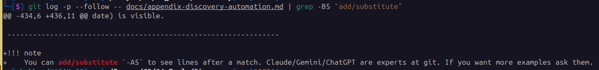

# Automating Discovery

This appendix assumes a small Ubuntu 26.04 desktop Virtual Machine at the customer site — not your own Windows workstation — that runs Discovery unattended on a schedule. HyperV, ESXi, KVM, ProxMox, doesn't matter what hosts it.

Here is what I used at a customer recently:

- **OS**: Ubuntu 26.04 Desktop (on Hyper-V)
- **Hostname:** Discover
- **IP address**: 10.100.126.100
- **Username**: mhubbard

If the customer doesn't already have one, stand up an Ubuntu 26.04 desktop VM first, replacing `mhubbard`, `discover`, and `10.100.126.100` with values for your customer.

----------------------------------------------------------------

## Set up the VM

Everything below (`bash`, `cron`, the Python `venv`, `git`) runs on that VM, typically reached over SSH from your own laptop. If you are onsite, you can use the Ubuntu 26.04 desktop from the hypervisor.

Open a terminal, `ctrl+alt+t`, then update the package repositories before installing the necessary packages:

```bash
sudo apt update
```

If this is a new install you will probably see packages that need updating after the `sudo apt update` command finishes. If so, run:

```bash
sudo apt upgrade -y
```

----------------------------------------------------------------

Install the following on the Ubuntu 26.04 Virtual Machine:

- git - The version control tool
- python3 - The latest Python version
- python3-venv - The Python virtual environment package
- snmp - Needed only if you want to poll a firewall
- openssh-server - Not included in an Ubuntu Desktop install by default; needed both to `ssh` into the host for management and to run the `scp` examples later in this appendix

Paste these commands into the terminal an press enter. Click the :material-content-copy: icon on the right to copy the commands to the clipboard.

```bash
sudo apt install git -y
sudo apt install python3 -y
sudo apt install python3-venv -y
sudo apt install snmp -y
sudo apt install openssh-server -y
```

`openssh-server` starts itself immediately on install — no separate enable
step needed there. `ufw` is a different story: a fresh Ubuntu install ships
it installed but inactive, so without doing anything else, SSH (and
`scp`, used throughout this appendix) is reachable from the whole LAN with
no firewall in front of it at all. Turn `ufw` on with SSH allowed, in that
order, before relying on either:

```bash
sudo ufw allow ssh
sudo ufw --force enable
```

That's still wide open to any source on the LAN — good enough to get
`scp` and the rest of this appendix working, but not where to leave it.
This VM is a good candidate to become a jump box instead — see
[Restricting SSH on the Automation Host](appendix-jump-box-hardening.md)
for scoping logins down to a management subnet or a short trusted-host
list once the rest of this setup is working.

Then clone the Discovery repo:

```bash
cd ~/Documents
git clone https://github.com/rikosintie/Discovery.git
cd Discovery
```

Since Ubuntu and `python3-venv` are already covered above, create the
virtual environment and install the pinned dependencies. The purpose of the virtual environment it to isolate the packages in Discovery from the Python packages that Ubuntu uses. If you want more detail see [Getting Started](Getting_Started.md#2-using-a-python-virtual-environment){: target="_blank" rel="noopener" }.

```bash
python -m venv venv --upgrade-deps --prompt="Discovery"
source venv/bin/activate
python3 -m pip install --no-deps -r requirements.lock.txt
```

`deactivate` stops the venv when you're done working in it interactively —
the daily wrapper script (below) activates and deactivates it on its own
each run, so this is only needed for manual testing.

The following steps:

- the `SNMP_COMMUNITY` variable
- `snmp_arp_cache.py` line in the wrapper script

are only needed if the site also has a firewall whose ARP table you're pulling — see [Polling a Firewall's ARP Table via SNMP](appendix-firewall-arp-snmp.md){: target="_blank" rel="noopener" }.

Skip those specific pieces if not; everything else in this appendix applies
regardless.

----------------------------------------------------------------

## Credential handling for scripts

Nothing in Discovery ever takes a password on the command line, and none of
the scripts have a password hardcoded. `config-pull.py` reads the switch
password from the `cyberARK` environment variable or prompts for it
interactively with `-p 1`; see [Usage](usage.md#password){: target="_blank" rel="noopener" }. The username comes from the device-inventory file. `snmp_arp_cache.py` reads `SNMP_COMMUNITY` and `FIREWALL_HOST` the same way.

For unattended runs, the one thing that matters is protecting the file that
supplies those environment variables — `~/.config/discovery/cyberark.env`,
`chmod 600` so only the account running the scripts can read it (see
[Create a credentials file](#create-a-credentials-file) below).

----------------------------------------------------------------

## Getting scripts on/off the automation host

The Discovery scripts themselves arrive via `git clone` — you don't need to copy those by hand. But you'll still occasionally need to move a one-off file between your laptop and the automation host: a site-specific data file before the repo is fully set up, or a log/data file you want to look at locally afterward. Use `scp` (secure copy, built on SSH) for both
directions from a single command line.

Two machines, two IPs — easy to mix up on site. Example values from a real
engagement:

- **Host (automation VM):** `10.100.126.100`
- **My Laptop:** `10.100.126.110`

----------------------------------------------------------------

**Laptop → host** (push) — run this from your laptop, `10.100.126.110`, for
example, copying a device-inventory CSV you built while scoping the site
onto the VM before the first run:

```bash
scp device-inventory-cust1.csv mhubbard@10.100.126.100:~/Documents/Discovery/
```

----------------------------------------------------------------

**Host → laptop** (pull) — also run from your laptop, `10.100.126.110`; `scp`
has no way to reach out from the host uninvited, so the pull direction is
still a command you type on the laptop, just with source and destination
swapped. For example, copying today's log back to your laptop to review
locally:

```bash
scp mhubbard@10.100.126.100:~/discovery-daily.log . # (1)!
```

1. That trailing `.` means "into my current directory" — easy to miss, easy to break the command if you drop it.

----------------------------------------------------------------

`scp SOURCE DESTINATION` — whichever side has the `user@host:` prefix is the
remote end (the automation host, `10.100.126.100`); the side without it is
wherever you're running the command from (your laptop).

**Pushing from the host instead** — some prefer to look around on the host
first (`ls *.sh`, `ls *.log`) to see what's actually there, then push
straight from the host to the laptop rather than pulling blind. Same `scp`
command either way, just typed on the host instead of the laptop, with the
laptop now on the receiving end — only how you get a terminal open on the
host differs:

SSH'd into the host from the laptop:

```bash
ssh mhubbard@10.100.126.100
ls *.sh *.log
scp discovery-daily.log mhubbard@10.100.126.110:~/Downloads/
```

----------------------------------------------------------------

Sitting at the host's own desktop directly (Hyper-V console, or a customer
who wants everything driven from the Ubuntu box's own screen instead of your
laptop) — same last two lines, just skip the `ssh` step since you're already
there:

```bash
ls *.sh *.log
scp discovery-daily.log mhubbard@10.100.126.110:~/Downloads/
```

!!! Note "The laptop needs an SSH server and a firewall hole for it"
    The `ssh mhubbard@10.100.126.100` step above relies on `sshd` running on
    the host — from the `openssh-server` install earlier in this appendix.
    Either way you got there, the final `scp` line connects *to* the laptop
    instead, so the laptop needs its own SSH server running and reachable,
    which most laptops don't have by default:

    - **Ubuntu laptop**: `sudo apt install openssh-server`, then open the
      firewall for it: `sudo ufw allow ssh`
    - **Windows 11 laptop**: enable **Settings → System → Optional Features
      → OpenSSH Server**, then allow it through Windows Firewall — either
      the prompt that appears the first time a connection comes in, or an
      inbound rule for port 22 in **Windows Defender Firewall → Advanced
      Settings**

    If that sounds like more setup than it's worth for a one-off file, it
    usually is — the pull examples above need nothing extra on the laptop.

!!! Note "Windows 11"
    `scp` ships built into Windows 11 as part of the OpenSSH client — no
    install needed. Open PowerShell or Windows Terminal and the same two
    commands above work as-is.

    If you're on an older Windows 10 build without OpenSSH, or you'd rather
    have a drag-and-drop GUI — the same kind of tool many network engineers
    already use for firmware uploads — install
    [WinSCP](https://winscp.net/eng/download.php): open a new **SFTP**
    session to `10.100.126.100` with the `mhubbard` credentials, then drag
    files between the local and remote panes in either direction.

----------------------------------------------------------------

## Daily automation

A daily schedule is used here since the Discovery scripts are lightweight —
a SSH pulls against switches, plus one SNMP walk
against the firewall — and daily granularity on the MAC table / port maps
is more useful for catching device moves close to when they happen.

Wrapper script (`~/discovery-daily.sh`) that sources credentials, activates
the venv, runs the pull/merge/map sequence, commits results to a local git
repo, and appends a timestamp to `~/discovery-last-run.txt` so a completed
run can be confirmed without digging through the log.

----------------------------------------------------------------

### Create a credentials file

The credentials file (`~/.config/discovery/cyberark.env`, `chmod 600`) — despite the name, `cyberARK` isn't tied to any actual CyberArk vault here, just a plain exported value. cyberARK is hard coded into config-pull.py, you cannot rename it without editing config-pull.py.

Paste the following into the terminal. Replace `the_actual_password`, `the_actual_community_string` and the ip address with values from you environment.

```bash
mkdir -p ~/.config/discovery
cat > ~/.config/discovery/cyberark.env << 'EOF'
export cyberARK=the_actual_password
export SNMP_COMMUNITY=the_actual_community_string
export FIREWALL_HOST=10.100.126.1
EOF
chmod 600 ~/.config/discovery/cyberark.env
```

(`SNMP_COMMUNITY` and `FIREWALL_HOST` are only needed if this site has a
firewall you're polling for ARP data — see
[Polling a Firewall's ARP Table via SNMP](appendix-firewall-arp-snmp.md).
`snmp_arp_cache.py` has no hardcoded default IP, so `FIREWALL_HOST` must be
set to whatever this customer's firewall actually is.)

View the file:

```bash
cat ~/.config/discovery/cyberark.env
```

You should see:

```bash
export cyberARK=the_actual_password
export SNMP_COMMUNITY=the_actual_community_string
export FIREWALL_HOST=10.100.126.1
```

----------------------------------------------------------------

### Create the shell script

The wrapper script lives directly in the home directory — not inside the
Discovery repo folder itself — since it's a personal utility rather than
part of the versioned codebase, and that's the path the crontab entry below
expects:

```bash
cd ~
touch discovery-daily.sh
nano discovery-daily.sh
```

Paste the following into nano, then `ctrl+s` to save, `ctrl+x` to close it.

Just like in the credential file, change:

- jc-4500
- jc-edge
- jc-core

To values from your environment.

```bash
#!/bin/bash
set -e

source ~/.config/discovery/cyberark.env
cd ~/Documents/Discovery
source venv/bin/activate

python3 snmp_arp_cache.py  # only if this site has a firewall to poll
python3 config-pull.py -s jc-4500
python3 config-pull.py -s jcedge
python3 arp.py -s jcedge -c jc-core
python3 merge-firewall-arp.py -c jc-core  # only if this site has a firewall to poll
python3 port-map.py -s jcedge -c jc-core -d 10.100.126.6

deactivate

git add .
git diff --cached --quiet || git commit -m "Daily discovery run $(date '+%Y-%m-%d %H:%M')"

echo "$(date '+%Y-%m-%d %H:%M') - run completed, exit $?" >> ~/discovery-last-run.txt
```

(`-c jc-core` on the merge step is this customer's core switch name, matching
`arp.py`'s `-c` value — **adjust it per site**. See
[Polling a Firewall's ARP Table via SNMP](appendix-firewall-arp-snmp.md) for
the SonicWall/FortiGate setup that feeds `snmp_arp_cache.py`.)

----------------------------------------------------------------

### Make discovery-daily.sh executable

```bash
chmod +x discovery-daily.sh
ls -l discovery-daily.sh # should see -rwxr-xr-x
```

The `git diff --cached --quiet ||` guard skips the commit (rather than
erroring under `set -e`) on runs where nothing changed.

Note: because of `set -e`, if any Python script earlier in the sequence
fails, the whole script exits immediately and the final `echo` line never
runs — so a missing entry in `discovery-last-run.txt` is itself the failure
signal, not just a silent gap.

----------------------------------------------------------------

### Create the schedule

Crontab entry (daily at 18:00):

```bash
crontab -e
```

An editor will open, scroll to the bottom and paste this in:

```bash
0 18 * * * /home/mhubbard/discovery-daily.sh >> /home/mhubbard/discovery-daily.log 2>&1
```

The `0 18` means run at 18:00. If you want it to run at 23:30 use `30 23`.

----------------------------------------------------------------

## Git repo

- Discovery is installed by `git clone`ing the public GitHub repo (see
  [Getting Started](Getting_Started.md)), so remove the inherited remote and
  history before running on customer data. This prevents customer data from
  accidentally being pushed back to the public repo:

  ```bash
  cd ~/Documents/Discovery
  rm -rf .git
  git init
  git add .
  git commit -m "Initial commit"
  ```

- Set local commit identity to the site account rather than a real person's
  name — `mhubbard` here is the automation VM's own account (the same one
  from the table at the top of this appendix), not a human name. The
  `@localhost` is used since the VM isn't going to be sending email:

  ```bash
  git config --global user.name "mhubbard"
  git config --global user.email "mhubbard@localhost"
  ```

- `.gitignore` should exclude the venv, Python cache, and (if it were ever
  placed inside the repo — it shouldn't be) the credentials file:

  ```bash
  cd ~/Documents/Discovery
  nano .gitignore
  ```

  Paste the following into the `.gitignore` file:

  ```bash
  venv/
  __pycache__/
  *.pyc
  cyberark.env
  ```

- Confirm no remote is configured, so a stray `git push` can't send customer
  network data anywhere:

  ```bash
  git remote -v   # should return nothing
  ```

!!! note "This means `git pull` won't work anymore, on purpose"
    With no remote configured, there's nothing for `git pull` to pull from —
    it'll just error out. That's the tradeoff for keeping customer data out
    of the public repo's history. To pick up script updates later, clone a
    fresh copy of Discovery somewhere else and copy over just the `.py`
    files you need — don't `git pull` (or re-clone) directly into the
    customer's own repo, since that would pull the public remote back in.

### Finding what changed when something breaks

The whole point of committing every daily run is that `git log` and
`git diff` become a change-history tool for the network itself — useful when a switch problem is suspected and the question is "what changed, and when," not just "something's different."

See which days have a commit, and when:

```bash
git log --oneline --since="2 weeks ago"
```

Diff two days' output directly — for example, if today's port map looks
wrong, compare it against yesterday's:

```bash
git diff HEAD~1 HEAD -- port-maps/jc-core-Mac2IP.json
```

An empty result just means that file didn't change between those two
commits — not that the command is broken. `arp.py` rebuilds
`<core>-Mac2IP.json` from scratch on every run, so it's a good file to test
this against: it's virtually guaranteed to differ day to day. Other files
(a switch config that hasn't changed, say) can easily go several days with
no diff at all, and that's expected too.

----------------------------------------------------------------

You can also use `git diff filename` to the see difference between a committed file and one on disk:

```bash hl_lines='1'
git diff -- firewall_arp_cache.csv
```

```bash title='Command Output'
diff --git a/firewall_arp_cache.csv b/firewall_arp_cache.csv
index b350a9f..e0fe87e 100644
--- a/firewall_arp_cache.csv
+++ b/firewall_arp_cache.csv
@@ -1,19 +1,22 @@
 IP Address,Type,MAC Address,Vendor,Interface
-35.129.96.1,Dynamic,0A:00:00:00:01:23,,X2
-192.168.10.13,Dynamic,64:52:99:69:FD:20,,X1
-192.168.10.105,Dynamic,00:9D:6B:A0:45:28,,X1
-192.168.10.107,Dynamic,F8:30:02:36:A6:09,,X1
-192.168.10.108,Dynamic,44:67:55:03:D4:72,,X1
... Output truncated for brevity
+35.129.96.1,Dynamic,0A:00:00:00:01:23,,
+192.168.10.13,Dynamic,64:52:99:69:FD:20,ChamberlainG,
+192.168.10.50,Dynamic,FC:EC:DA:C4:6E:55,Ubiquiti,
+192.168.10.52,Dynamic,98:F2:B3:FE:88:80,HewlettPacka,
+192.168.10.105,Dynamic,00:9D:6B:A0:45:28,MurataManufa,
+192.168.10.107,Dynamic,F8:30:02:36:A6:09,TexasInstrum,
+192.168.10.108,Dynamic,44:67:55:03:D4:72,OrbitIrrigat,
```

In this example, I had rewritten `snmp_arp_cache.py` to include the manufacture and drop the interface.

----------------------------------------------------------------

To find exactly which day a specific MAC or IP address first showed up (or
disappeared) on a port, search the file's own commit history instead of
diffing day by day:

```bash
git log -p --follow -- port-maps/Final/jc-mdf-1-ports.txt | grep -B5 "00:1a:2b:3c:4d:5e"
```

----------------------------------------------------------------

(`port-map.py` writes one `Final/<hostname>-ports.txt` per switch — a site
with several closets ends up with `jc-mdf-1-ports.txt`, `jc-mdf-2-ports.txt`,
`jc-idf-2-ports.txt`, and so on. Substitute whichever closet's file is
actually in question.)

`-p` shows the actual diff at each commit that touched the file, `--follow`
keeps working even if the file was ever renamed, and the `grep -B5` pulls up
the 5 lines before each match so the surrounding commit header (with its
date) is visible.

----------------------------------------------------------------

!!! note
    You can add/substitute `-A5` to see lines after a match. Claude/Gemini/ChatGPT are experts at git. If you want more examples ask them.

Here is an example from this document. I added the note above, committed, then ran:

----------------------------------------------------------------

```bash linenums='1' hl_lines='1'
git log -p --follow -- docs/appendix-discovery-automation.md | grep -B5 "add/substitute"
@@ -434,6 +436,11 @@ date) is visible.

 ----------------------------------------------------------------

+!!! note
+    You can add/substitute `-A5` to see lines after a match. Claude/Gemini/ChatGPT are experts at git. If you want more examples ask them.
```

----------------------------------------------------------------

{ width="500"}

In the image, you can see that the matched text is highlighted in red.

----------------------------------------------------------------

## Log rotation

Daily cron output grows fast. Create a `logrotate` file to compress and
delete old entries.

Create the `logrotate` config:

```bash
sudo nano /etc/logrotate.d/discovery-daily
```

Paste this into nano:

```bash
/home/mhubbard/discovery-daily.log {
    daily
    rotate 12
    compress
    missingok
    notifempty
    copytruncate
    su mhubbard mhubbard
}
```

### Explanation of settings

- daily: Rotates the log file every single day. You can use `weekly` if disk space isn't an issue.
- rotate 12: Keeps a maximum history of 12 archived log files. On the 13th day, the oldest log file is permanently deleted.
- compress: Compresses the old log files using gzip to save disk space (saving them as .log.1.gz, .log.2.gz, etc.).
- missingok: If the discovery-daily.log file is missing for some reason on a given day, do not throw an error; just move on silently.
- notifempty - Do not rotate the log if it is empty. This prevents creating a bunch of empty backup files if nothing happened that day.
- notifempty: Do not rotate the log if it is empty. This prevents creating a bunch of empty backup files if nothing happened that day.
- su mhubbard mhubbard: Tells logrotate to switch users and handle this specific log file using the user mhubbard and group mhubbard. This avoids permission conflicts if the directory or log is owned by you rather than the system root user.

----------------------------------------------------------------

!!! note
    The `su mhubbard mhubbard` directive is required when the log's parent
    directory is owned by a non-root user — logrotate (run as root via cron)
    otherwise refuses to rotate it, citing insecure parent-directory permissions.
    `su` tells logrotate to act as that user instead, sidestepping the check.

----------------------------------------------------------------

Test manually:

```bash
sudo logrotate -f /etc/logrotate.d/discovery-daily
```

**Rotation timing vs. verifying the job ran:** on modern Ubuntu, logrotate
runs via a systemd timer, not plain cron — by default `OnCalendar=daily`
(around midnight) with a 12-hour accuracy window, so it can fire anywhere
from midnight to noon.

Check the actual schedule on a given box with:

```bash
systemctl list-timers logrotate.timer
```

With `copytruncate`, rotation zeroes the live log file. Since the discovery
script runs at 18:00 and rotation happens sometime between midnight and
noon, the live `discovery-daily.log` will read empty for most of the day —
that's expected, not a sign the job failed. Don't rely on tailing the live
log alone to confirm the job is working; instead:

- Check `~/discovery-last-run.txt` (see wrapper script above) — a plain
  timestamp line untouched by log rotation
- Check git commit history/timestamps in the Discovery repo — a real proof
  of execution independent of the log entirely
- Check already-rotated logs when the live one is empty:
  `zcat discovery-daily.log.1.gz | tail -50`
- Confirm cron actually fired it:
  `journalctl -u cron --since "1 day ago" | grep discovery-daily`

## Testing a cron job without waiting for its real schedule

Temporarily set the crontab entry a couple of minutes ahead, for example, to
run at 18:05:

```bash
crontab -e
5 18 * * * /home/mhubbard/discovery-daily.sh >> /home/mhubbard/discovery-daily.log 2>&1
```

then:

```bash
tail -f /home/mhubbard/discovery-daily.log       # watch script output live
journalctl -u cron -f                            # confirm cron actually fired it
watch -n 1 'ps aux | grep -E "config-pull|arp.py|merge-firewall|port-map"'  # optional
```

Revert to the real schedule once confirmed.
