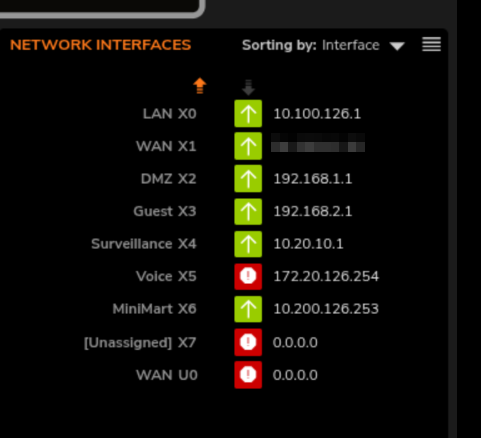
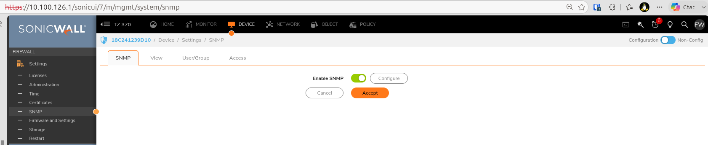
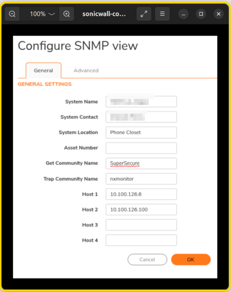
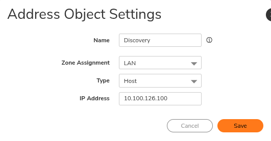
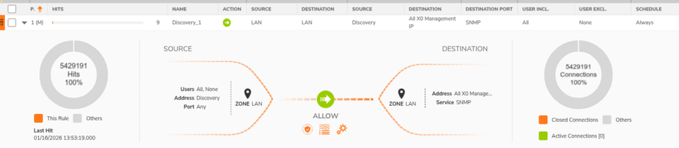
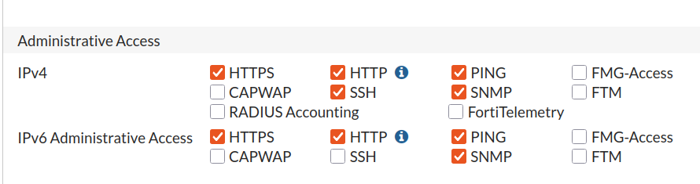
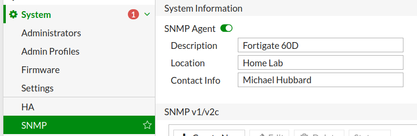
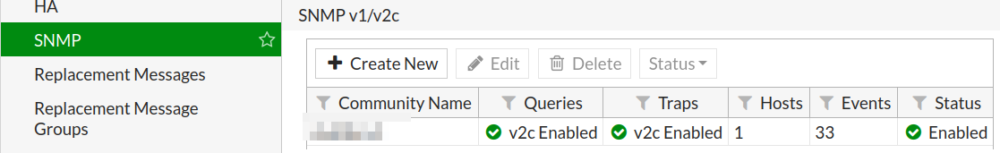
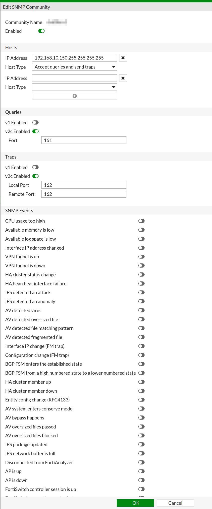

# Polling a Firewall's ARP Table via SNMP

`arp.py`/`config-pull.py` only see MAC/ARP data for VLANs that have an SVI
on a switch — that's what puts the entry in a switch's own ARP table in the
first place. Some VLANs terminate directly on the firewall instead, so no
switch ever sees them. This appendix covers pulling those entries straight
from the firewall via SNMP and merging them back in.

The tooling here — `snmp_arp_cache.py` — just walks the standard ARP MIB
(`ipNetToMediaTable`, OID `1.3.6.1.2.1.4.22`), so it isn't tied to one
vendor. Two real examples run it against, below: a **SonicWall TZ370** at a
customer site, and a **FortiGate 60D** in a home lab. Both worked with the
same script and no code changes.

----------------------------------------------------------------

## The automation host

This appendix assumes a small Ubuntu 26.04 desktop Virtual Machine at the customer site — not your own Windows workstation — that runs Discovery unattended on a schedule. HyperV, ESXi, KVM, ProxMox, doesn't matter what hosts it.

Here is what I used at a customer recently:

- **OS**: Ubuntu 26.04 Desktop (on Hyper-V)
- **Hostname:** Discover
- **IP address**: 10.100.126.100
- **Username**: mhubbard

If the customer doesn't already have one, stand up an Ubuntu 26.04 desktop VM first, replacing `mhubbard`, `discover`, and `10.100.126.100` with values for your customer.

----------------------------------------------------------------

Install the following on the VM.

- sudo apt update - Update the package repositories before installing
- git - `sudo apt install git`
- python3- `sudo apt install python3`
- python3-venv - `sudo apt install python3-venv`
- snmp - `sudo apt install snmp`

then clone the Discovery repo and follow the setup in [Getting Started](Getting_Started.md). Everything below —

- `bash`
- `cron`
- the Python `venv`
- `git`

runs on that VM, typically reached over SSH from your own laptop.

Skip this whole appendix if the customer's firewall doesn't terminate any
VLANs directly (i.e. every VLAN routes through a switch SVI) — there's
nothing for `snmp_arp_cache.py` to add in that case.

----------------------------------------------------------------

## Why poll the firewall

`arp.py`/`config-pull.py` get their MAC/ARP data by querying the switches —
which only works for VLANs that actually have an SVI on a switch, since
that's what puts the ARP entry in the switch's own table in the first place.
Zones that terminate directly on the firewall instead — WAN, DMZ, Guest,
Voice, and similar — never touch the switch fabric at all, so there's no ARP
entry on any switch for `arp.py` to find; it isn't a parsing gap, the data
genuinely isn't there. Polling the firewall's own ARP table via SNMP is the
only way to get those entries, and `merge-firewall-arp.py` is what folds
them into the same MAC/IP data `arp.py` already produced for everything
else.

In the SonicWall example below, the following networks terminate on the
firewall and only traverse the core switch as Layer 2:

- DMZ
- Guest
- Surveillance
- MiniMart

----------------------------------------------------------------



----------------------------------------------------------------

For repeatable, scriptable access, the two real options are:

- **SNMP** — poll the standard ARP MIB (`ipNetToMediaTable`, OID
  `1.3.6.1.2.1.4.22`) — this is what the rest of this appendix covers, and
  it works the same way regardless of vendor
- **Vendor REST API** — SonicOS, for example, exposes one under
  **Device | Settings | Administration | SonicOS API**; authenticate against
  `POST /api/sonicos/auth`, then query the appropriate endpoint (the exact
  ARP monitoring path isn't clearly documented — check the API
  browser/explorer linked from that same settings page, or use the generic
  `POST /api/sonicos/direct/cli` endpoint to push a raw CLI command and get
  JSON back). Every vendor's REST API is different, which is exactly why
  SNMP — a real standard — is the path this appendix builds on.

## SonicWall SNMP

SonicOS 7.x's GUI ARP Cache page (**Network > ARP > ARP Cache**) does not
include an Export button in current firmware builds — that feature existed
in the older SonicOS 6.5 UI but was dropped. The CLI doesn't help either:
`show arp` returns the ARP *configuration* stanza (`timeout`, `glean`)
rather than the live dynamic table, since SonicOS's CLI is primarily a
configuration interface, not a diagnostics one. SNMP is the practical path.

Firmware: SonicOS 7.0.1-5169. Goal: enable SNMP on the LAN (X0) interface,
restricted to a single polling host (the automation VM, `10.100.126.100`) on
the `10.100.126.0/24` LAN zone. You'll do this on the **LAN to LAN** matrix
(self-management traffic on the LAN zone) — the same pattern SonicWall uses
for restricting WAN management, just applied to LAN instead.

**1. Enable SNMP as a service**

1. **Device | Settings | SNMP**
2. Check **Enable SNMP** → click **Accept**
3. Click **Configure** and set:
      - **Get Community Name** (used by `snmpwalk`/`snmpget` — this is your `-c` value)
      - Optionally **Trap Community Name** and **Host 1–n** if you want the firewall to send traps to a management system
4. Click **OK**

----------------------------------------------------------------



----------------------------------------------------------------



----------------------------------------------------------------

**2. Enable SNMP on the LAN (X0) interface**

1. **Network | System | Interfaces**
2. Edit **X0**
3. In the **Management** section, check **SNMP**
4. Click **OK**

This auto-generates a management access rule permitting SNMP to the
firewall's LAN IP — by default with **Source: Any**. That's the part locked
down in step 4 below.

----------------------------------------------------------------

**3. Create an address object for the polling host**

1. **Object | Address Objects | Add**
2. Name: e.g. `snmp-poller`
3. Zone Assignment: **LAN**
4. Type: **Host**
5. IP Address: `10.100.126.100`
6. **Save**

----------------------------------------------------------------



----------------------------------------------------------------

**4. Restrict the SNMP management rule's source**

1. **Policy | Rules and Policies | Access Rules**
2. Switch view style to **Matrix**
3. Click the **LAN to LAN** cell
4. Find the auto-added SNMP management rule → **Configure**
5. Change **Source** from **Any** to `snmp-poller`
6. Click **OK**

----------------------------------------------------------------

**This is the actual restriction** — steps 1–3 just turn SNMP on. With
Source scoped to `snmp-poller`, only `10.100.126.100` can reach SNMP on the
firewall; SonicOS denies non-matching traffic on management rules by
default, so nothing else on the `/24` needs an explicit deny rule.

----------------------------------------------------------------



----------------------------------------------------------------

!!! note
    v2c sends the community string in cleartext, which sounds worse than it
    is here: `snmp_arp_cache.py` only ever calls `snmpwalk -v2c` — there's no
    SNMPv3 support to fall back to, so v2c is the only option regardless.
    The real protection isn't on the wire, it's the access rule from step 4
    above — SonicOS only accepts SNMP from `snmp-poller`'s IP at all, so
    there's nothing on the LAN positioned to intercept that traffic in the
    first place. Scoping the source is what actually matters here, not the
    protocol version.

Verify from the automation VM:

```bash
sudo apt update
sudo apt install snmp -y
snmpwalk -v2c -c <community_string> 10.100.126.1 1.3.6.1.2.1.4.22
```

(OID `1.3.6.1.2.1.4.22` is the standard ARP MIB, `ipNetToMediaTable`.)

----------------------------------------------------------------

### Enabling SSH on the SonicWall (optional)

Not required by the automated pipeline — SNMP is all `snmp_arp_cache.py`
needs — but SSH is useful for manually running `show arp` or other CLI diagnostics on the firewall itself. SSH management is off by default per-interface:

1. **Network > Interfaces** → edit the interface owning the management IP
2. **Management** section → toggle **SSH** on
3. **OK**

If connecting from a different zone/VLAN than the target interface, an
access rule permitting SSH traffic from that source zone may also be
required.

----------------------------------------------------------------

## Example 2: FortiGate 60D (home lab)

Confirming the SNMP MIB really is vendor-agnostic: the same
`snmp_arp_cache.py`, no code changes, run against a FortiGate 60D
(FortiOS 6.0.18) instead of a SonicWall worked perfectly.

----------------------------------------------------------------

### ⚠ Before applying this on a production/customer box

This config was built for a single-purpose home-lab monitoring setup and
makes two changes that can silently break existing SNMP usage if applied
elsewhere without checking first:

- **Hosts is restrictive, not additive.** If another monitoring tool, RMM,
  or NMS is already polling this device under the same community string
  from a different source IP, setting Hosts to a single `/32` will lock
  that tool out exactly the way it locked out this monitoring host
  originally. Before narrowing Hosts on an existing production FortiGate,
  check `show system snmp community` for any Hosts entries already
  present, and check with the customer whether SNMP is already in use by
  another platform (backup software, an RMM, a NOC tool, etc.) before
  replacing that entry.
- **`unset events` disables all trap events, not just queries.** Polling
  (`snmpget`/`snmpwalk`, and most NMS "SNMP monitor" checks) is unaffected
  by this — it only stops the FortiGate from proactively sending traps for
  things like CPU-high, HA failover, or AV/IPS detections. If the
  customer's monitoring depends on receiving traps rather than polling,
  leave the SNMP Events toggles alone, or re-enable them.

----------------------------------------------------------------

## Fortigate SNMP

The FortiGate was configured via CLI rather than GUI here. The `show` output further down is included as a reference for reading it — FortiOS only prints lines that differ from their defaults, which can make a config block look sparser than what's actually active and shown in the GUI.

The full `show system interface internal` output has a lot in it — VLAN
forwarding, IPv6, the interface's own IP — none of which is what you're
here to change. The only thing that actually needs to happen is adding
`snmp` to that interface's `allowaccess` list:

```text
config system interface
    edit "internal"
        set allowaccess ping https ssh snmp http
    next
end
```

!!! warning
    `set allowaccess` **replaces** the whole list, it doesn't append to it.
    The list above happens to be the standard set most setups have enabled
    (ping/https/ssh/snmp/http) — but if your site also uses something less
    common (CAPWAP for managed APs, RADIUS Accounting, FMG-Access, etc.),
    pasting this line verbatim would silently turn that off. Run
    `show system interface internal` first and add `snmp` to your own site's
    actual list instead of copying this one.

----------------------------------------------------------------

{ width="300" }

----------------------------------------------------------------

Live output from `show system snmp sysinfo`:

```text
config system snmp sysinfo
    set status enable
    set description "Fortigate 60D"
    set contact-info "Michael Hubbard"
    set location "Home Lab"
end
```

----------------------------------------------------------------

{ width="300" }

----------------------------------------------------------------

Live output from `show system snmp community`:

```bash linenums="1"
config system snmp community
    edit 1
        set name "dvd0brx1"
        config hosts
            edit 1
                set ip 192.168.10.150 255.255.255.255
            next
        end
        set query-v1-status disable
        set trap-v1-status disable
        unset events
    next
end
```

----------------------------------------------------------------

{ width="300" }

The community name field is essentially the password used for snmp. Do not save it in a text file accessible to every user. Save it in a password manager line `KeepassXC` or `Bitwarden`. You can use either of those for free on the automation VM.

----------------------------------------------------------------

{ width="300" }

----------------------------------------------------------------

In the above screenshot, you can see that I disabled all snmp events because I don't have `Solarwinds`, `Nagios`, etc. receiving traps from the Fortigate. The `unset events` on line 11 above disables **ALL** snmp traps. Before running the code, run `config system snmp community` to check what is enabled. If all events are enabled, the default, no events will be shown.

For an example, I enabled:

- CPU usage too high
- Available memory is low

Here is what that looks like:

```bash
config system snmp community
    edit 1
        set name "dvd0brx1"
        config hosts
            edit 1
                set ip 192.168.10.150 255.255.255.255
            next
        end
        set query-v1-status disable
        set trap-v1-status disable
        set events cpu-high mem-low
    next
end
```

----------------------------------------------------------------

Notes on reading this against the GUI screens:

- `status enable`, `query-v2c-status enable`, `trap-v2c-status enable`, the
  port numbers, and the long list of SNMP Events shown as toggled on in the
  GUI don't appear here — FortiOS only writes a line to `show` output when a
  value differs from its default. All of those are sitting at their
  (enabled) default, so there's nothing to override and nothing to show.
  Don't read their absence as "not configured."
- `host-type` also isn't shown for the same reason — `query` (queries +
  traps) is the default, matching "Accept queries and send traps" in the
  GUI.
- The only two things FortiOS considered non-default and worth writing out
  are the community name, the Hosts IP/mask (the actual fix — scoped to the
  single monitoring host at `192.168.10.150` rather than the whole LAN
  subnet, intentionally, to keep the exposure tight for whoever maintains
  this config later), and the two `v1-status disable` lines (v1 is off in
  favor of v2c-only).

Verify from the automation VM and a host not listed in the `community name` — the SNMP host restriction above means nothing else on the LAN can reach this at all:

```bash
# from the automation host
# Basic reachability / sysDescr — should always answer if the agent is up
snmpget -v2c -c <community_string> 192.168.10.254 1.3.6.1.2.1.1.1.0
iso.3.6.1.2.1.1.1.0 = STRING: "Fortigate 60D"

# sysName
snmpget -v2c -c <community_string> 192.168.10.254 1.3.6.1.2.1.1.5.0
iso.3.6.1.2.1.1.5.0 = STRING: "Hubbard.pu.pri"

# ARP table walk
snmpwalk -v2c -c <community_string> 192.168.10.254 1.3.6.1.2.1.4.22
iso.3.6.1.2.1.4.22.1.1.1.192.168.10.222 = INTEGER: 1
iso.3.6.1.2.1.4.22.1.1.2.35.129.96.1 = INTEGER: 2
iso.3.6.1.2.1.4.22.1.2.1.192.168.10.13 = Hex-STRING: 64 52 99 69 FD 20
iso.3.6.1.2.1.4.22.1.2.1.192.168.10.50 = Hex-STRING: FC EC DA C4 6E 55
```

----------------------------------------------------------------

## The ARP polling script

`snmp_arp_cache.py` ships in the Discovery repo alongside the other scripts
— it arrives with `git clone`, no separate copy step needed. It walks the
ARP MIB via `snmpwalk` and writes `firewall_arp_cache.csv` in the same 5-column
format `merge-firewall-arp.py` already expects
(`IP Address,Type,MAC Address,Vendor,Interface`), so no changes are needed
to the merge script itself.

The firewall's IP is a required `--host` argument (or `FIREWALL_HOST`
environment variable):

- `--host` / `FIREWALL_HOST` — the firewall's management IP, e.g. `10.100.126.1`
- `SNMP_COMMUNITY` — the v2c community string configured on the firewall (env
  var only — a CLI argument would leave it visible in shell history and `ps`
  output)

Add the community string and host to the credentials file so you're not
typing `--host` every time — the same `~/.config/discovery/cyberark.env`
the rest of Discovery already uses (see
[Credential handling for scripts](appendix-discovery-automation.md#credential-handling-for-scripts)):

```bash
cat >> ~/.config/discovery/cyberark.env << 'EOF'
export SNMP_COMMUNITY=the_actual_community_string
export FIREWALL_HOST=10.100.126.1
EOF
```

Then source it and run the script:

```bash
source ~/.config/discovery/cyberark.env
python3 snmp_arp_cache.py
```

Or, to test one-off without touching the credentials file yet, pass `--host`
directly (still needs `SNMP_COMMUNITY` set some other way, since there's no
CLI flag for it):

```bash
python3 snmp_arp_cache.py --host 10.100.126.1
```

A successful run prints a count of entries written, e.g.
`Wrote 42 entries to firewall_arp_cache.csv`.

----------------------------------------------------------------

### Real examples: SonicWall vs FortiGate

Both examples below are genuine runs against real firewalls — the SonicWall
one replays real captured ARP entries from the customer engagement described
above, the FortiGate one is a live poll of the actual home-lab 60D.

**SonicWall TZ370:**

```bash
$ python3 snmp_arp_cache.py --host 10.100.126.1
Wrote 6 entries to firewall_arp_cache.csv
```

```text
IP Address,Type,MAC Address,Vendor,Interface
10.20.10.17,Dynamic,54:BF:64:99:E1:90,Dell,
10.20.10.30,Dynamic,F0:79:59:39:41:C5,ASUSTekCOMPU,
10.100.126.1,Static,18:C2:41:23:9D:10,SonicWall,
10.100.126.130,Dynamic,4C:D7:17:24:62:45,Dell,
192.168.2.1,Static,18:C2:41:23:9D:13,SonicWall,
192.168.2.18,Dynamic,2C:27:D7:38:5A:39,HewlettPacka,
```

**FortiGate 60D:**

```bash
$ python3 snmp_arp_cache.py --host 192.168.10.254
Wrote 21 entries to firewall_arp_cache.csv
```

```text
IP Address,Type,MAC Address,Vendor,Interface
35.129.96.1,Dynamic,0A:00:00:00:01:23,,
192.168.10.13,Dynamic,64:52:99:69:FD:20,ChamberlainG,
192.168.10.50,Dynamic,FC:EC:DA:C4:6E:55,Ubiquiti,
192.168.10.105,Dynamic,00:9D:6B:A0:45:28,MurataManufa,
192.168.10.123,Dynamic,9C:DA:A8:DA:6C:29,Apple,
192.168.10.141,Dynamic,88:A2:9E:43:4D:DE,RaspberryPi,
192.168.10.222,Dynamic,00:0C:29:B1:6C:05,VMware,
... (21 total)
```

Both come out in the same 5-column shape regardless of vendor — that's the
point of polling standard SNMP instead of a vendor-specific export. A blank
`Vendor` (like `35.129.96.1` above) just means that MAC's OUI isn't in the
local database, not a script problem — see `--update-manuf` on `port-map.py`
if the OUI database needs refreshing.

----------------------------------------------------------------

### SNMP quirks worth knowing

A couple of SNMP gotchas surfaced while getting this working, both worth
watching for on any similar setup:

1. **Only force hex output (`-Ox`) on OIDs you actually need raw bytes
   from.** `-Ox` hex-encodes *all* OCTET STRINGs in the response, including
   human-readable ones, so applying it broadly turns readable text into
   garbage. Here, that's the MAC address column and nothing else.

2. **SNMP index numbering doesn't reliably line up across MIBs, or across
   vendors.** On a SonicWall TZ370, IF-MIB's `ifDescr` table numbers
   interfaces differently than the `ifIndex` embedded in `ipNetToMediaTable`
   entries — they're off by one zone (`ifIndex 4` reads as `X3 (Guest)` in
   `ifDescr`, not `X4`). And even within one MIB, `ifIndex` is just a small
   integer the device's own agent assigns — it doesn't correspond to any
   particular interface-naming scheme, which is why `Interface` in this
   script's output is always left blank rather than derived from it.

Also worth noting: **CSV column count and naming must exactly match** what
the downstream script expects. An extra `Timeout` column (with no SNMP
equivalent to populate it) caused `merge-firewall-arp.py` to silently match
zero rows even though the file parsed fine on its own — there was no error,
just quietly wrong output. When feeding one script's output into another,
diff the header row against a known-working reference file rather than
assuming a superset of columns is harmless.

----------------------------------------------------------------

### Expected merge count

`merge-firewall-arp.py` merges every row in the CSV unconditionally —
`port-map.py` only ever looks up `Mac2IP.json` by MAC and has no concept of
the firewall's own Interface labels, so there's nothing worth filtering by.
For a MAC the core switch's own ARP table already resolved correctly, the
firewall's cache should agree on the same IP, so the overwrite is a harmless
no-op rather than something to guard against. The printed merge count should
equal the CSV's row count; if it's noticeably lower, something's wrong (a
MAC that doesn't convert cleanly, a malformed row) and is worth investigating.

Running it against each of the two CSVs above:

```bash
$ python3 merge-firewall-arp.py -c jc-core
Merged 6 entries from firewall_arp_cache.csv into port-maps/jc-core-Mac2IP.json
```

```bash
$ python3 merge-firewall-arp.py -c jc-core
Merged 21 entries from firewall_arp_cache.csv into port-maps/jc-core-Mac2IP.json
```

Both match their CSV's row count exactly — 6 in, 6 merged; 21 in, 21 merged
— which is the healthy result described above.

Keep in mind that the whole point of polling the firewall is to capture ARP records that won't be on the core switch. I have had several customers that keep Surveillance cameras, the Guest devices (hotels), IoT devices, etc. as L2 on the network switches and do all of the routing on a Firewall.

----------------------------------------------------------------

### Wiring the SNMP pull into daily automation

Community string and firewall IP added to the existing credentials file,
`~/.config/discovery/cyberark.env`, so the cron wrapper never needs a
`--host` flag typed anywhere:

```bash
export cyberARK=the_actual_password
export SNMP_COMMUNITY=the_actual_community_string
export FIREWALL_HOST=10.100.126.1
```

Called in the wrapper script ahead of the merge step so the CSV exists
before `merge-firewall-arp.py` runs — see
[Daily automation](appendix-discovery-automation.md#daily-automation)
in the Automating Discovery appendix for the full script. No changes are
needed to the cron entry itself.
