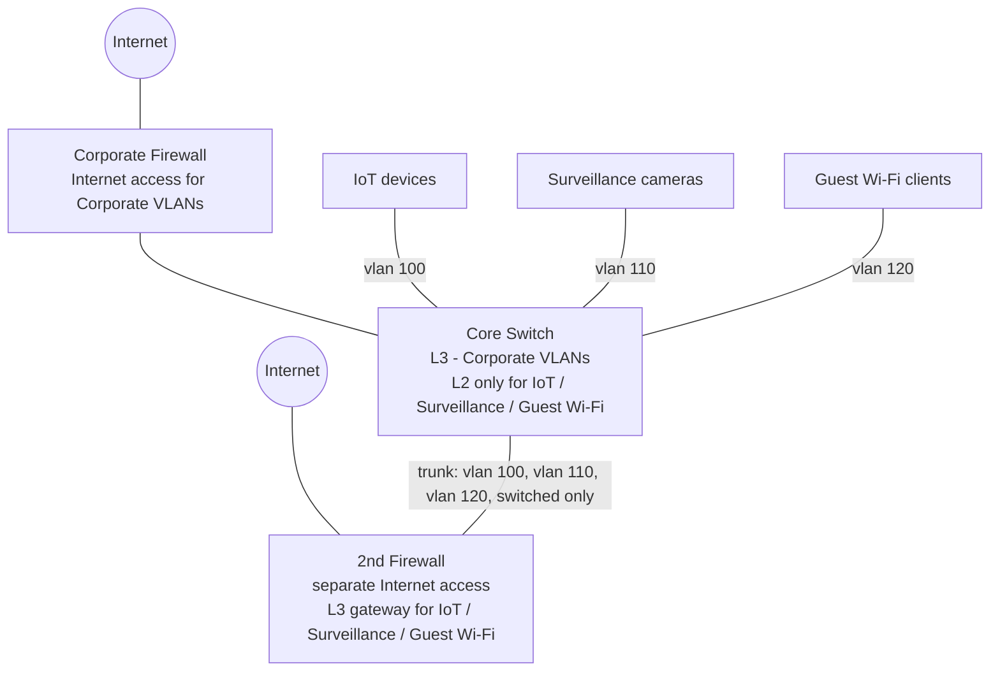
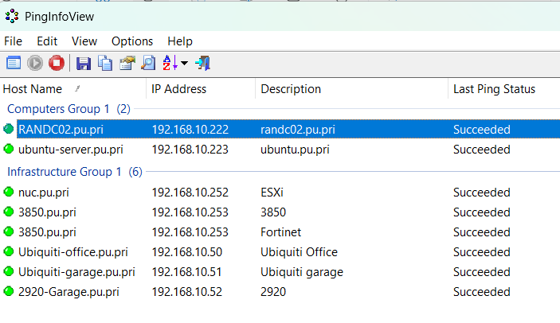
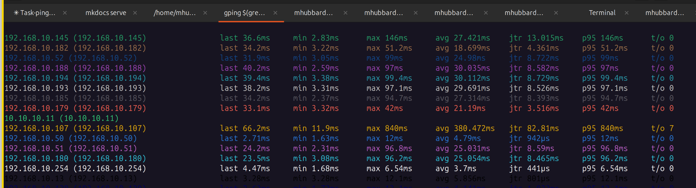

# Creating Port maps

Building a port map is a two-step process: `arp.py` builds an IP-to-MAC
lookup table from a switch's ARP cache, then `port-map.py` matches that
table against the switch's MAC address table to show what's plugged into
every port.

**`arp.py`** converts the IP and ARP records into `"mac": "ip"` pairs and
saves them to hostname-Mac2IP.json in the data folder. The MAC address is
used as the key since MACs are unique; the IP address is the value:

```bash
{
    "04d590-0e77ab": "10.1.0.252",
    "883a30-76ce00": "10.154.1.3",
    "104f58-682100": "10.154.1.4",
    "b8d4e7-4c4900": "10.154.1.5",
}
```

**`port-map.py`** matches the MAC address in the hostname-Mac2IP.json file to the mac address in the hostname-mac-address.txt file.

The port maps return:

- Vlan ID
- IP Address
- MAC Address
- Interface
- Vendor ID
- DNS Name (populated when a DNS server is passed with `-d`)

----------------------------------------------------------------

Here is an example of the port map:

```text title="Port Map Example"
Number of Entries: 42

Device Name: lab-3850

Vlan    IP Address         MAC Address          Interface      Vendor           DNS Name
───────────────────────────────────────────────────────────────────────────────────────────────────────
10      192.168.10.112     04db.56ed.ad58       Gi1/0/1        Apple            1S1K-iPad
───────────────────────────────────────────────────────────────────────────────────────────────────────
10      192.168.10.145     3817.c3c9.20c2       Gi1/0/1        HewlettPacka     Garage-325
───────────────────────────────────────────────────────────────────────────────────────────────────────
10      192.168.10.182     80be.afe1.cbf5       Gi1/0/1        HikvisionDig     Cam-Hikvision
───────────────────────────────────────────────────────────────────────────────────────────────────────
10      192.168.10.52      98f2.b3fe.8880       Gi1/0/1        HewlettPacka     2920-Garage
```

Having this information makes identifying special devices such as HVAC controllers, Door access controllers, Cameras, etc. easier. It also allows you to verify that all devices are patched back into the correct port on the switch.

----------------------------------------------------------------

## Running the port map scripts

There are two general categories of switch deployments. The first is a distributed layer 3 deployment where every closet has a layer 3 router. In that case, the procurve-Config-pull has created an arp.txt file and mac-address.txt file for every switch and the script reads the same inventory file and matches the hostname-arp.txt file with the hostname-mac-address.txt file.

The second is a Core/IDF deployment where there is a layer 3 switch in an MDF and the closets are connected at layer 2. In this case, we have to use an argument in the port-map.py script to tell it which hostname-arp.txt file to use for each hostname-mac-address.txt file.

----------------------------------------------------------------

### Running the arp.py script

One script handles the arp step for every supported vendor. It finds the IP and MAC on each line by content rather than assuming a fixed column layout, so it doesn't matter whether the vendor prints Cisco-style `Internet <ip> <age> <mac> ARPA VlanN`, ProCurve-style `<ip> <mac> <type> <port>`, or Aruba CX-style `<ip> <mac> <vlan> <port> <state> <vrf>`.

Example of a distributed layer 3 deployment:

`python3 arp.py -s area1`

For a Core/IDF deployment, use `-c coreswitch`:

`python3 arp.py -s jc-edge -c JC-core`

The script will create the hostname-Mac2IP.json and will print some information to the screen. The first information is the file being processed and the number of IPs and the IPs sorted. Here is an example:

```text
----------------------------------------------------------------------------------------
Reading devices from: /home/mhubbard/04_Tools/Discovery/port-maps/data/test-Core-arp.txt
----------------------------------------------------------------------------------------
Number of IP Addresses: 566
---------------------------
10.1.0.252
10.112.1.3
```

The next output is IP and MAC Addresses. Here is an example:

```text
Number of IP and MAC Addresses: 566
-----------------------------------
10.1.0.252 04d590-0e77ab
10.112.1.3 883a30-76ce00
```

And finally, the IP, MAC and Manufacture. Here is an example:

```text
Number of IP, MAC and Manufacture: 566
--------------------------------------
10.1.0.252 04d590-0e77ab Fortinet
10.112.1.3 883a30-76ce00 ArubaaHe
```

If you have a need for this information great, if not just ignore it.

----------------------------------------------------------------

### Merging external ARP data (SonicWall, FortiGate, etc.)

In a Core/IDF deployment, `-c coreswitch` assumes the core switch itself
has an SVI (and therefore an ARP entry) for every VLAN. That's not always
true — some sites route a subset of VLANs through a separate firewall
(SonicWall, FortiGate, WatchGuard, ...) instead of using the core switch for
routing, so the switch's own `show ip arp` never sees those IPs and
`port-map.py` reports those hosts as `No-Match` even though the firewall
knows exactly who they are.

A common shape for this — a core switch handling routing for the corporate
network itself, with a second firewall carved out for VLANs that never
touch the core's own routing table:



The core switch is the L3 gateway (and has an SVI/ARP entry) for the
Corporate VLANs, so `arp.py` sees those hosts fine. IoT, Surveillance, and
Guest Wi-Fi only ever touch the core as a switched (L2) trunk — their real
default gateway is the second firewall, which routes them out its own
separate Internet connection. `arp.py` reading the core's `show ip arp`
never sees those hosts; `firewall-merge.py` is what fills them back in from
the second firewall's own ARP cache.

`firewall-merge.py` is a one-off for this: it reads a MAC/IP table
exported from the firewall's ARP cache (`firewall-arp.csv`, written by
`firewall-snmp.py` — see
[Polling a Firewall's ARP Table via SNMP](../appendix/appendix-firewall-arp-snmp.md) for
setup — with columns `IP Address,Type,MAC Address,Vendor,Interface`),
converts each MAC to the dot-grouped `aabb.ccdd.eeff` format, and merges
them into the existing `coreswitch-Mac2IP.json`.

Run it **after** `arp.py` and **before** `port-map.py` — `arp.py` rebuilds
`coreswitch-Mac2IP.json` from scratch every run, so anything merged in
before that gets wiped:

```bash
python3 arp.py -s jcedge -c jc-core
python3 firewall-merge.py -c jc-core
python3 port-map.py -s jcedge -c jc-core -d 10.100.126.6
```

`-c` matches whatever core switch name `arp.py`/`port-map.py` used — it
determines which `port-maps/<core>-Mac2IP.json` gets updated. Every row in
the CSV gets merged unconditionally — `port-map.py` only looks up
`Mac2IP.json` by MAC and has no concept of the firewall's own Interface
labels, so there's nothing to filter by (see
[Polling a Firewall's ARP Table via SNMP](../appendix/appendix-firewall-arp-snmp.md)).

`firewall-merge.py` always writes MACs in that one dot-grouped format,
regardless of what notation the core switch itself uses — it doesn't check
whether the core switch is Cisco, ProCurve, or Aruba CX. That's not a
problem: `port-map.py` strips every separator out of a MAC before comparing
it (see its `normalize_mac`), specifically so a `Mac2IP.json` with mixed
notation — some keys in the core switch's own format from `arp.py`, some in
Cisco's from `firewall-merge.py` — still matches correctly no matter
which vendor's ARP table originally produced them.

Enable SNMP on the firewall if it isn't already, then run
`firewall-snmp.py` to build `firewall-arp.csv` — see
[Polling a Firewall's ARP Table via SNMP](../appendix/appendix-firewall-arp-snmp.md)
for the setup steps. It's vendor-agnostic (confirmed working against both a
SonicWall TZ370 and a FortiGate 60D with no code changes) and takes the
firewall's IP via `-H`/`--host` (or the `FIREWALL_HOST` environment
variable), so there's no per-site editing needed before running it.

----------------------------------------------------------------

#### Testing snmp

On Ubuntu you can quickly install snmp and grab the ARP table from most files since they support the standard snmp MIB.

Install snmp using:

```bash
sudo apt update # Update the package repositories before installing
sudo apt install snmp # install snmp
```

----------------------------------------------------------------

Then run either of these commands. The `<community string>` is the snmp community (password). You will probably have to get that from your security team:

```bash hl_lines='1 3'
snmpwalk -v2c -c <community> <firewall-ip> ipNetToMediaTable
# or by OID directly:
snmpwalk -v2c -c <community> <firewall-ip> .1.3.6.1.2.1.4.22
```

```text title='snmp output'
snmpwalk -v2c -c dvd0brx1 192.168.10.254 .1.3.6.1.2.1.4.22
iso.3.6.1.2.1.4.22.1.2.1.192.168.10.13 = Hex-STRING: 64 52 99 69 FD 20
iso.3.6.1.2.1.4.22.1.2.1.192.168.10.105 = Hex-STRING: 00 9D 6B A0 45 28
iso.3.6.1.2.1.4.22.1.2.1.192.168.10.107 = Hex-STRING: F8 30 02 36 A6 09
iso.3.6.1.2.1.4.22.1.2.1.192.168.10.108 = Hex-STRING: 44 67 55 03 D4 72
iso.3.6.1.2.1.4.22.1.2.1.192.168.10.112 = Hex-STRING: 04 DB 56 ED AD 58
iso.3.6.1.2.1.4.22.1.2.1.192.168.10.113 = Hex-STRING: 2A 38 72 30 E7 AE
```

Having this skill can come in handy even it you don't need it for discovery. When trouble shooting a firewall issue, being able to rapidly pull the arp table is handy. If you are looking for specific IP address you could use:

----------------------------------------------------------------

```text
snmpwalk -v2c -c dvd0brx1 192.168.10.254 .1.3.6.1.2.1.4.22 | grep 192.168.10.112
```

----------------------------------------------------------------

```text title='Grep output'
iso.3.6.1.2.1.4.22.1.1.1.192.168.10.112 = INTEGER: 1
iso.3.6.1.2.1.4.22.1.2.1.192.168.10.112 = Hex-STRING: 04 DB 56 ED AD 58
iso.3.6.1.2.1.4.22.1.3.1.192.168.10.112 = IpAddress: 192.168.10.112
iso.3.6.1.2.1.4.22.1.4.1.192.168.10.112 = INTEGER: 3
```

----------------------------------------------------------------

### Running the port-map.py script

One script handles the port-map step for every supported vendor — ProCurve, Cisco, and Aruba CX. It reads the hostname-Mac2IP.json and hostname-mac-address.txt files, detects each line's MAC format and column order rather than assuming a fixed layout, and creates the port maps — with a manufacturer lookup via the maintained `manuf2` package and, when a DNS server is available, a reverse-DNS name column.

```text
python3 port-map.py -h
usage: port-map.py [-h] [-s SITE] [-c CORESWITCH] [-d DNS] [--update-manuf]

-s site, -c core hostname in a Core/IDF deployment, -d dns server for reverse lookups, --update-manuf to refresh the OUI database

options:
  -h, --help            show this help message and exit
  -s, --site SITE       Site name - ex. HQ
  -c, --coreswitch CORESWITCH
                        Coreswitch hostname
  -d, --dns DNS         DNS server IP for reverse lookups - ex. 192.168.10.222
  --update-manuf        Download the latest Wireshark OUI database (and WFA registry) and exit — run this if new devices are showing up with no vendor
```

`python3 port-map.py -s area1`

For a Core/IDF deployment, use `-c coreswitch`:

`python3 port-map.py -s jc-edge -c JC-core`

To resolve DNS names for the IP addresses in the port map, pass a DNS server with `-d`:

`python3 port-map.py -s jc-edge -c JC-core -d 192.168.10.222`

----------------------------------------------------------------

### Updating the vendor (OUI) database

Both scripts above (arp.py, port-map.py) use the `manuf2` package to resolve a MAC address's manufacturer. The OUI database it ships with needs to be refreshed occasionally — newly-registered hardware won't have a vendor until it's in the database you have locally, and shows up as `None` instead. When that happens, run either:

```bash
python3 arp.py --update-manuf
python3 port-map.py --update-manuf
```

Both of these download the latest OUI and WFA (Wi-Fi Alliance) data and exit — none of them need `-s site`, and none touch any inventory files.

----------------------------------------------------------------

### PingInfoView export

Every run also writes `port-maps/pinginfo/hostname-pinginfo.txt` — an
import file for [PingInfoView](https://www.nirsoft.net/utils/multiple_ping_tool.html)
(a free NirSoft tool, **Windows only**, that pings a list of hosts and
shows which ones respond). If you use Windows it's worth your time to look at [nirsoft.net](https://www.nirsoft.net) because he has a ton of free networking tools for Windows. It's nirsoft.net, not nirsoft.com. someone bought nirsoft.com and it's all malware I think!

Each reachable IP from the port map is paired
with its DNS name, or its MAC address if no DNS name resolves. The use
case is verifying hosts across a cutover: export the list before the
change, import it into PingInfoView, and watch which hosts go down and
come back afterward, without having to `ping` each one by hand.

----------------------------------------------------------------

Here is a screenshot of PingInfoView



----------------------------------------------------------------

Notice the `Computers Group 1` and the `Infrastructure Group` titles? One of the best features of PingInfoView for daily use is that you can create groups. Here is the text file I use in my home lab to create that screenshot:

```bash linenums='1' hl_lines='1'
Group: Computers Group 1
192.168.10.222 randc02.pu.pri
192.168.10.223 ubuntu.pu.pri
Group: Infrastructure Group 1
192.168.10.50 Ubiquiti Office
192.168.10.51 Ubiquiti garage
192.168.10.52 2920
192.168.10.252 ESXi
192.168.10.253 3850
192.168.10.253 Fortinet
```

----------------------------------------------------------------

### Mac/Linux equivalent: gping and fping

PingInfoView being Windows-only doesn't leave Mac/Linux users without an
option — `gping` (a live graph of ping times) and `fping` (a fast,
parallel ping sweep) cover the same "watch a list of hosts across a
cutover" use case, and both can read straight from an existing
`hostname-pinginfo.txt` file.

Install with your platform's package manager:

```bash
brew install gping fping        # macOS/Ubuntu
sudo apt install gping fping    # Debian/Ubuntu
```

----------------------------------------------------------------

**`gping`** (visual terminal graphs) — parse the IPv4 targets out of a
pinginfo file and graph them. Given more hosts than fit on one graph, it
switches to the compact per-host stats table shown below automatically:

```bash
gping $(grep -oE '\b([0-9]{1,3}\.){3}[0-9]{1,3}\b' Lab_3850-pinginfo.txt)
```

----------------------------------------------------------------

{ width="500" }

----------------------------------------------------------------

Note the address `10.10.10.11` in the image. It's a loopback on a switch that hasn't come up yet. Notice that it has no data in the chart.

----------------------------------------------------------------


| Column | Meaning |
|--------|---------|
| `last` | Latency of the most recent ping to that host |
| `min` | Smallest latency recorded so far |
| `max` | Largest latency recorded so far |
| `avg` | Average latency across every ping so far |
| `jtr` | Jitter — the average change in latency between one ping and the next, in the order they actually happened. High jitter means latency is bouncing around, even if the average looks fine |
| `p95` | 95th-percentile latency — 95% of pings to that host were faster than this |
| `t/o` | Timeouts — how many pings to that host got no response at all |

!!! info
    The chronological-order detail on `jtr` matters in practice: a host whose
    latency is *steadily drifting* (5ms creeping up to 50ms over a minute, say,
    from mounting congestion) has a wide `min`/`max` spread but a small change
    from any one ping to the next — low jitter, correctly, since nothing is
    actually unstable moment-to-moment. A host *ping-ponging* between 5ms and
    50ms every other ping has the exact same `min`/`max` spread, but every
    single step is a big jump — high jitter, correctly flagging the real
    instability. Sorting the values first (as `min`/`max`/`avg`/`p95` all do)
    would make those two situations look identical; `jtr` deliberately doesn't
    sort, because it's answering a different question than the rest of the
    table — not "how spread out are these latencies" but "how much does
    latency swing from one ping to the next." That's also the standard
    definition of jitter used in VoIP/QoS contexts (RFC 3550), so gping isn't
    reinventing the term — worth knowing precisely because it's easy to assume
    a "high/low" stat like this is sorted, when this one specifically isn't.

----------------------------------------------------------------

**`fping`** (continuous text pings) — parse the same targets and sweep
them all in parallel:

```bash
grep -oE '\b([0-9]{1,3}\.){3}[0-9]{1,3}\b' Lab_3850-pinginfo.txt | fping -l
```

----------------------------------------------------------------

**Shell functions** (`~/.zshrc`) — add these to parse and ping any
pinginfo file by name, instead of retyping the `grep` each time:

```zsh
# Graph targets visually via gping
gping-info() {
    if [[ -z "$1" ]]; then
        echo "Usage: gping-info <pinginfo-file>"
        return 1
    fi
    gping $(grep -oE '\b([0-9]{1,3}\.){3}[0-9]{1,3}\b' "$1")
}

# Sweep targets continuously via fping
fping-info() {
    if [[ -z "$1" ]]; then
        echo "Usage: fping-info <pinginfo-file>"
        return 1
    fi
    grep -oE '\b([0-9]{1,3}\.){3}[0-9]{1,3}\b' "$1" | fping -l
}
```

----------------------------------------------------------------

Here is a gping-info example run from the root of discovery:

```bash
gping-info port-maps/pinginfo/lab-3850-pinginfo.txt
```

----------------------------------------------------------------

### "UP with no learned MAC address" warning

A switch port can show `link_status: up` (and `protocol_status: up`) in
config-pull.py's `hostname-interface.json` capture while having no rows at
all in `hostname-mac-address.txt` — the port is physically connected, but
the device on it hasn't sent traffic recently enough to still be in the
switch's MAC address table. Without a flag for this, that host is just
silently missing from the port map.

port-map.py cross-references the two files for each device and, when it
finds any, prints a warning panel at the top of `hostname-ports.txt`,
right below the version banner:

```bash
╭───── ⚠ 5 interface(s) UP with no learned MAC address ─────╮
│ GigabitEthernet1/0/3                                       │
│ GigabitEthernet1/0/27                                      │
│ GigabitEthernet1/0/30                                      │
│ GigabitEthernet1/0/35                                      │
│ GigabitEthernet1/0/46                                      │
│                                                              │
│ Run pinger.py to refresh the mac address table              │
│ (uplinks/trunks may show up here too — eyeball those out)   │
╰──────────────────────────────────────────────────────────────╯
```

`pinger.py` is the recommended way to clear this — see [Warming the ARP
cache with pinger.py](pinger.md#warming-the-arp-cache-with-pingerpy). Run it against
the site's subnets to generate traffic from those hosts, then re-run
config-pull.py and port-map.py to pick up the newly-learned MAC entries.

Uplink/trunk ports to other switches can legitimately show up in this list
too, since a per-interface MAC query on a trunk is often empty by design.
For now, eyeball those out; filtering them out automatically is a planned
refinement.
