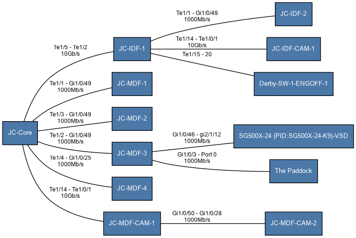
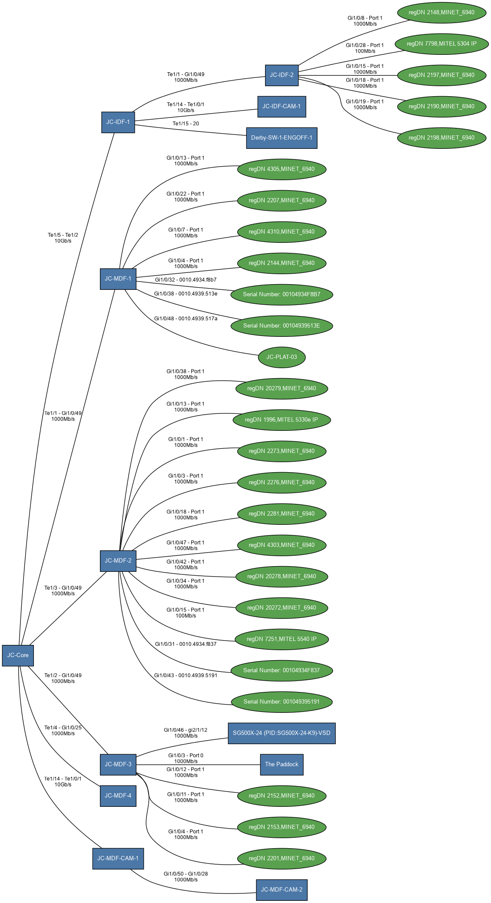
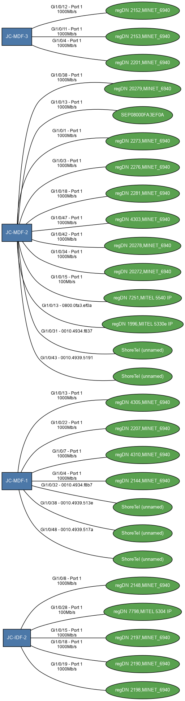

# Topology diagrams with topo-map.py

`cdp-ne.py` and `lldp-ne.py` report one switch at a time. `topo-map.py` is
the whole-network view built on the same data: it reads every
`Interface/*-cdp.txt` and `Interface/*-lldp.txt` — both protocols, every
host — and draws a topology diagram as Graphviz SVG and PNG.

```bash
python3 topo-map.py                  # the whole topology, unfiltered
python3 topo-map.py -s               # core backbone only
python3 topo-map.py -p               # phones (and each phone's own switch)
python3 topo-map.py -s -p            # core backbone + phones/APs
python3 topo-map.py -o site1-topology # use "site1-topology" as the filename
```

Each run writes `<out>.dot`, `<out>.svg`, and `<out>.png` (default basename
`topology`). Rendering shells out to Graphviz's `dot` command, which has to
be installed separately — it's a system package, not something
`requirements.txt`/`pip install` can pull in for you.

----------------------------------------------------------------

## Installing Graphviz

- **Linux (Debian/Ubuntu):** `sudo apt install graphviz`
- **macOS:** `brew install graphviz` (same [Homebrew](https://formulae.brew.sh/formula/lldpd)
  used elsewhere in this doc for `lldpd`)
- **Windows:** `winget install --id Graphviz.Graphviz` from cmd or
  PowerShell — see [Install Git](Getting_Started.md#install-git) for what to
  do if `winget` itself isn't available (it ships with Windows 11 21H2+, but
  older installs may not have it). No `winget`? The
  [official installer](https://graphviz.org/download/) works too.

Whichever way you install it, open a **new** terminal afterward — an
already-running shell won't see a PATH change an installer just made. If
`topo-map.py` still reports `dot` command was not found after that, `dot`
isn't on PATH; the Windows installer in particular has historically shipped
with "add Graphviz to the system PATH" unchecked by default; re-run it and
enable that option, or add the install folder's `bin` directory to PATH by
hand.

----------------------------------------------------------------

## Examples

Three examples from a real site, one per filtering mode:

**Core backbone** (`python3 topo-map.py -s -o topology-core`) — every
switch/router/AP, links between them only:

----------------------------------------------------------------



----------------------------------------------------------------

**Edge switches** (`python3 topo-map.py -s -p -o topology-edge`) — the same
backbone, plus every phone and AP hanging off each edge switch:

----------------------------------------------------------------



----------------------------------------------------------------

**Phones only** (`python3 topo-map.py -p -o jc-phones`) — every phone and
the switch it's plugged into, no backbone context saved at jc-phones.png.

!!! note
    Mitel phones return their extension number so it's included in the diagram. It appears as `regDN 2201` for example. It's a nice feature when you need to find a particular phone!

----------------------------------------------------------------



----------------------------------------------------------------

## Nodes and dedup

Every capture host is a switch by definition — `config-pull.py` only runs
against managed switches — so local hosts are always drawn as core devices.
Anything that only shows up as a *neighbor* is colored by its advertised
capabilities:

- **core** (blue box) — CDP `Router`/`Switch`, LLDP `R`/`B`/`router`/
  `bridge`/`wlan-access-point` (switches, routers, APs)
- **phone** (green ellipse) — CDP `Phone`, LLDP `T`/`telephone`
- **other** (gray box) — everything else (PCs, printers, unclassified)

This is token-based, not an exact capability-string match, so a plain
access switch that only ever advertises `Switch IGMP` (no `Router`) still
counts as core.

The same physical device merges into one node wherever it's seen —
`jc-mdf-4` (a capture host) and `JC-MDF-4.tricommanagement.local` (how
`jc-core`'s CDP capture names it as a neighbor) fold together
case-insensitively — and a link reported from both ends, or by both CDP and
LLDP, collapses to a single edge instead of drawing it twice. A neighbor
that gave no name at all — some Cisco Small Business switches report a bare
MAC (`d4d748d09b00`, no separators) as their CDP device id — is labeled with
a `manuf2` OUI guess instead, e.g. `Cisco (unnamed)`, same as `cdp-ne.py`/
`lldp-ne.py`'s Name column.

----------------------------------------------------------------

## Filtering

- **`-s`, `--core`** — keep only core-to-core links: the backbone.
- **`-p`, `--phones`** — keep only phones. Since a phone's only possible
  neighbor is a switch, each phone's own switch is pulled in too, even
  without `-s` — otherwise a phone-only filter would always draw nothing.
- **`-s -p` together** — core backbone AND phones: an edge switch's uplink
  to the core and its phones/APs both survive. This is the shape worth
  diagramming for most sites — a pure `-p` fans every phone off its own
  switch with no backbone context, and a pure `-s` backbone won't show
  where the phones actually plug in.
- **neither flag** — the whole topology, unfiltered.

An edge survives a filter only if both its endpoints do (the `-p` exception
above aside); a node left with no edges afterward is dropped rather than
drawn floating.

----------------------------------------------------------------

## Link speed

Pulled from the *local* host's own `<host>-interface.json` and shown on the
edge label under the interface pair. Cisco captures include a `speed` field
(`"1000Mb/s"`); HP ProCurve's `-interface.json` only has port counters, so
ProCurve-side edges show interfaces without a speed.
